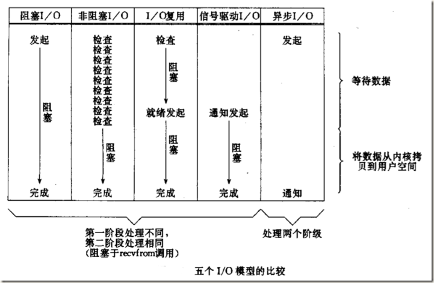

近来遇到了一些常见的概念，尤其是网络编程方面的概念，如：阻塞、非阻塞、异步I/O等等，对于这些概念自己也没有太清晰的认识，只是很模糊的概念，说了解吧也了解，但是要让自己准确的描述概念方面的具体细节，却说的不那么准确，这也是自己在这几个方面也没有细细考究过的原因吧。经过看了些这几个概念的资料，发现同步、异步、阻塞、非阻塞的概念其实也并不难以理解，在此写下此文，欢迎拍砖，希望多多交流。

# 1 同步与异步#

**首先来解释同步和异步的概念，这两个概念与消息的通知机制有关。也就是同步与异步主要是从消息通知机制角度来说的。**

## 1.1 概念描述##

`所谓同步就是一个任务的完成需要依赖另外一个任务时，只有等待被依赖的任务完成后，依赖的任务才能算完成，这是一种可靠的任务序列`。要么成功都成功，失败都失败，两个任务的状态可以保持一致。

`所谓异步是不需要等待被依赖的任务完成，只是通知被依赖的任务要完成什么工作，依赖的任务也立即执行，只要自己完成了整个任务就算完成了`。至于被依赖的任务最终是否真正完成，依赖它的任务无法确定，`所以它是不可靠的任务序列`。

## 1.2 消息通知##

`异步的概念和同步相对`。当一个同步调用发出后，`调用者要一直等待返回消息（结果）通知后`，才能进行后续的执行；当一个异步过程调用发出后，调用者不能立刻得到返回消息（结果）。`实际处理这个调用的部件在完成后，通过状态、通知和回调来通知调用者`。

这里提到执行部件和调用者通过三种途径返回结果：`状态、通知和回调`。使用哪一种通知机制，`依赖于执行部件的实现`，除非执行部件提供多种选择，`否则不受调用者控制`。

> 1. 如果执行部件用状态来通知，那么调用者就需要每隔一定时间检查一次，效率就很低（有些初学多线程编程的人，总喜欢用一个循环去检查某个变量的值，这其实是一种很严重的错误）；
> 2. 如果是使用通知的方式，效率则很高，因为执行部件几乎不需要做额外的操作。至于回调函数，其实和通知没太多区别。

## 1.2 场景比喻##

举个例子，比如我去银行办理业务，可能会有两种方式：

> 1. 选择排队等候；
> 2. 另种选择取一个小纸条上面有我的号码，等到排到我这一号时由柜台的人通知我轮到我去办理业务了；

第一种：`前者(排队等候)就是同步等待消息通知`，也就是我要一直在等待银行办理业务情况；

第二种：`后者(等待别人通知)就是异步等待消息通知`。在异步消息处理中，`等待消息通知者(在这个例子中就是等待办理业务的人)往往注册一个回调机制`，在所等待的事件被触发时由触发机制(在这里是柜台的人)通过某种机制(在这里是写在小纸条上的号码，喊号)找到等待该事件的人。

# 2 阻塞与非阻塞#

**阻塞和非阻塞这两个概念与程序（线程）等待消息通知(无所谓同步或者异步)时的状态有关。也就是说阻塞与非阻塞主要是程序（线程）等待消息通知时的状态角度来说的。**

## 2.1 概念描述##

`阻塞调用是指调用结果返回之前，当前线程会被挂起，一直处于等待消息通知，不能够执行其他业务`。函数只有在得到结果之后才会返回。

**有人也许会把阻塞调用和同步调用等同起来，实际上它们是不同的。**

1. `对于同步调用来说，很多时候当前线程可能还是激活的，只是从逻辑上当前函数没有返回而已，此时，这个线程可能也会处理其他的消息`。还有一点，在这里先扩展下：

> (a) 如果这个线程在等待当前函数返回时，仍在执行其他消息处理，那这种情况就叫做同步非阻塞；
>
> (b) 如果这个线程在等待当前函数返回时，没有执行其他消息处理，而是处于挂起等待状态，那这种情况就叫做同步阻塞；

**所以同步的实现方式会有两种：同步阻塞、同步非阻塞；同理，异步也会有两种实现：异步阻塞、异步非阻塞；**

1. 对于阻塞调用来说，则当前线程就会被挂起等待当前函数返回；

非阻塞和阻塞的概念相对应，`指在不能立刻得到结果之前，该函数不会阻塞当前线程，而会立刻返回`。虽然表面上看非阻塞的方式可以明显的提高CPU的利用率，`但是也带了另外一种后果就是系统的线程切换增加`。`增加的CPU执行时间能不能补偿系统的切换成本需要好好评估`。

## 2.2 场景比喻##

继续上面的那个例子，不论是排队还是使用号码等待通知，`如果在这个等待的过程中，等待者除了等待消息通知之外不能做其它的事情，那么该机制就是阻塞的`，表现在程序中,也就是该程序一直阻塞在该函数调用处不能继续往下执行。

相反，`有的人喜欢在银行办理这些业务的时候一边打打电话发发短信一边等待，这样的状态就是非阻塞的`，因为他(等待者)没有阻塞在这个消息通知上，而是一边做自己的事情一边等待。

但是需要注意了，`同步非阻塞形式实际上是效率低下的`，想象一下你一边打着电话一边还需要抬头看到底队伍排到你了没有。如果把打电话和观察排队的位置看成是程序的两个操作的话，这个程序需要在这两种不同的行为之间来回的切换，效率可想而知是低下的；而`异步非阻塞形式却没有这样的问题`，因为打电话是你(等待者)的事情，而通知你则是柜台(消息触发机制)的事情，程序没有在两种不同的操作中来回切换。

# 3 同步/异步与阻塞/非阻塞#

1. **同步阻塞形式**

效率是最低的，

拿上面的例子来说，就是你专心排队，什么别的事都不做。

**实际程序中：**就是未对fd 设置O_NONBLOCK标志位的read/write 操作；

1. **异步阻塞形式**

如果在银行等待办理业务的人`采用的是异步的方式去等待消息被触发（通知）`，也就是领了一张小纸条，假如在这段时间里他不能离开银行做其它的事情，那么很显然，这个人被阻塞在了这个等待的操作上面；

**异步操作是可以被阻塞住的，只不过它不是在处理消息时阻塞，而是在等待消息通知时被阻塞。**

比如select 函数，假如传入的最后一个timeout参数为NULL，`那么如果所关注的事件没有一个被触发，程序就会一直阻塞在这个select 调用处`。

1. **同步非阻塞形式**

实际上是效率低下的，

想象一下你一边打着电话一边还需要抬头看到底队伍排到你了没有，如果把打电话和观察排队的位置看成是程序的两个操作的话，`这个程序需要在这两种不同的行为之间来回的切换`，效率可想而知是低下的。

很多人会写阻塞的read/write 操作，`但是别忘了可以对fd设置O_NONBLOCK 标志位，这样就可以将同步操作变成非阻塞的了`。

1. **异步非阻塞形式**

效率更高，

因为打电话是你(等待者)的事情，而通知你则是柜台(消息触发机制)的事情，`程序没有在两种不同的操作中来回切换`。

比如说，这个人突然发觉自己烟瘾犯了，需要出去抽根烟，于是他告诉大堂经理说，排到我这个号码的时候麻烦到外面通知我一下(注册一个回调函数)，那么他就没有被阻塞在这个等待的操作上面，自然这个就是异步+非阻塞的方式了。

如果使用异步非阻塞的情况，比如aio_*组的操作，当发起一个aio_read操作时，`函数会马上返回不会被阻塞，当所关注的事件被触发时会调用之前注册的回调函数进行处理`。

很多人会把同步和阻塞混淆，我想是`因为很多时候同步操作会以阻塞的形式表现出来`，比如很多人会写阻塞的read/write操作，但是别忘了可以对fd设置O_NONBLOCK标志位，这样就可以将同步操作变成非阻塞的了。`但最根本是因为没有区分这两个概念`，比如阻塞的read/write操作中，`其实是把消息通知机制和等待消息通知的状态结合在了一起`，在这里`所关注的消息就是fd是否可读/写`，而`等待消息通知的状态则是对fd可读/写等待过程中程序（线程）的状态`。当我们将这个fd设置为非阻塞的时候，read/write操作就不会在等待消息通知这里阻塞，如果fd不可读/写则操作立即返回。

同样的，很多人也会把异步和非阻塞混淆，`因为异步操作一般都不会在真正的IO操作处被阻塞`，比如如果用select函数，`当select返回可读时再去read一般都不会被阻塞，而是在select函数调用处阻塞`。

# 4 小明的故事#

对上面所讲的概念再次进行一个场景梳理，上面已经明确说明，**同步/异步关注的是消息通知的机制，而阻塞/非阻塞关注的是程序（线程）等待消息通知时的状态**。以小明下载文件打个比方，从这两个关注点来再次说明这两组概念，希望能够更好的促进大家的理解。

1. **同步阻塞：小明一直盯着下载进度条，到 100% 的时候就完成。**

> 同步体现在：等待下载完成通知；
>
> 阻塞体现在：等待下载完成通知过程中，不能做其他任务处理；

1. **同步非阻塞：小明提交下载任务后就去干别的，每过一段时间就去瞄一眼进度条，看到 100% 就完成。**

> 同步体现在：等待下载完成通知；
>
> 非阻塞体现在：等待下载完成通知过程中，去干别的任务了，只是时不时会瞄一眼进度条；【小明必须要在两个任务间切换，关注下载进度】

1. **异步阻塞：小明换了个有下载完成通知功能的软件，下载完成就“叮”一声。不过小明仍然一直等待“叮”的声音（看起来很傻，不是吗）。**

> 异步体现在：下载完成“叮”一声通知；
>
> 阻塞体现在：等待下载完成“叮”一声通知过程中，不能做其他任务处理；

1. **异步非阻塞：仍然是那个会“叮”一声的下载软件，小明提交下载任务后就去干别的，听到“叮”的一声就知道完成了。**

> 异步体现在：下载完成“叮”一声通知；
>
> 非阻塞体现在：等待下载完成“叮”一声通知过程中，去干别的任务了，只需要接收“叮”声通知即可；【软件处理下载任务，小明处理其他任务，不需关注进度，只需接收软件“叮”声通知，即可】

也就是说，**同步/异步是“下载完成消息”通知的方式（机制），而阻塞/非阻塞则是在等待“下载完成消息”通知过程中的状态（能不能干其他任务）**，在不同的场景下，同步/异步、阻塞/非阻塞的四种组合都有应用。

所以，综上所述，`同步和异步仅仅是关注的消息如何通知的机制，而阻塞与非阻塞关注的是等待消息通知时的状态`。也就是说，`同步的情况下，是由处理消息者自己去等待消息是否被触发，而异步的情况下是由触发机制来通知处理消息者`，所以在异步机制中，`处理消息者和触发机制之间就需要一个连接的桥梁`：

> 在银行的例子中，这个桥梁就是小纸条上面的号码。
>
> 在小明的例子中，这个桥梁就是软件“叮”的声音。

原文链接: <https://www.jianshu.com/p/aed6067eeac9>