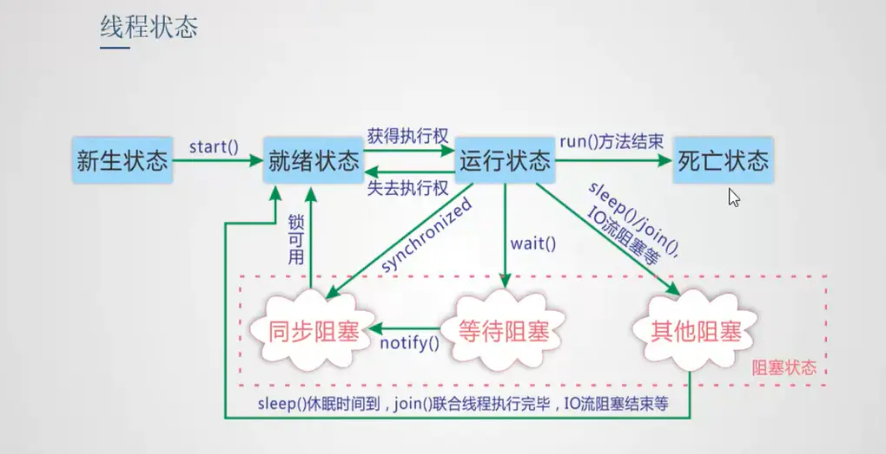
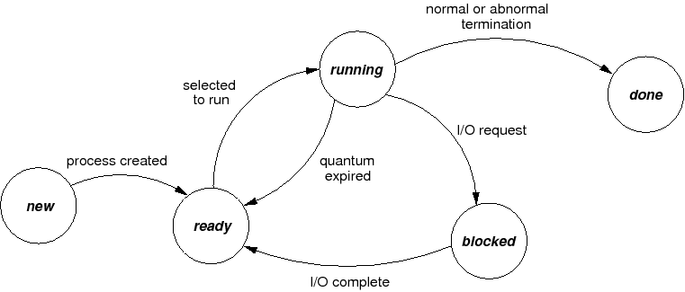

<!-- # 进程 Process

- 概念: 进程是正在执行程序的实例，是资源分配最小的单位，
    - 每个进程都有自己单独的资源区域。
- 守护进程：运行在后台的进程，用于执行特定的系统任务。
- 进程的状态：
    - 运行态，运行态指的就是进程实际占用 CPU 时间片运行时
    - 就绪态，就绪态指的是可运行，但因为其他进程正在运行而处于就绪状态
    - 阻塞态，除非某种外部事件发生，否则进程不能运行
    
    - 进程在运行期间，不断地从一种状态转换到另一种状态，它可以多次处于就绪状态和运行状态，也可以多次处于阻塞状态。
    - 进程表：为实现进程模型，每个进程占用一个进程表项，该进程表项包含了进程状态的重要信息，包括程序计数器、堆栈指针、内存分配状况、所打开文件的状态、帐号和调度信息等。

# 线程 Thread
2.线程
- 线程：cpu调度的最小单位。线程共享进程的资源，多个线程可以共享同一地址空间和其他资源，比如共享全局变量。线程作为进程的一部分，扮演的角色就是怎么利用中央处理器去运行代码。线程关注的是中央处理器的运行，而不是内存等资源的管理。


-新建状态、就绪状态、运行状态、阻塞状态、死亡状态



- 为什么多线程？
    - 线程比进程更加轻量级，线程更容易、快捷的创建和销毁。
    - 多CPU系统中，使用线程提高CPU利用率。
    - 并行实体共享同一个地址空间和所有可用数据的能力。

### 任意时刻 CPU 总是运行一个进程，其他进程属于非运行状态。

## 进程间通信
- 管道( pipe )：数据只能**单向流动**，而且只能在具有**亲缘关系**的进程间使用。进程的亲缘关系通常是指父子进程关系。半双工的通信方式（信息可以双向传输，但是不能同时）

- 有名管道 (namedpipe) ： 有名管道也是半双工的通信方式，但是它允许**无亲缘关系**进程间的通信。

- 消息队列( message queue ) ： 消息队列是有消息的链表，存放在内核中并。优点：数据可以有格式，但是任然有大小限制。

- 信号 (sinal ) ：是一种异步的通知机制，用来提醒进程一个事件已经发生。
    - 生命周期: 产生 > 进程中的注册 > 进程中的注销 > 捕获处理
    - 信号的产生: 
        - 硬件事件： 除数为零，无效的存储访问，例如野指针
        - 软件事件： ctrl+c_中断信号_SIGTSTP, ctrl+|_退出信号_SIGQUIT, ctrl+z_停止信号_SIGINT, kill 命令等
    - 信号的阻塞
        - 阻止一个信号的抵达，当一种信号被阻塞时，它仍可以被发送，但是产生的待处理信号不会被接收，直到进程取消对这种信号的阻塞。

- 共享内存(shared memory ) ：共享内存允许两个或更多进程访问同一块内存，就如同 malloc() 函数向不同进程返回了指向同一个物理内存区域的指针。

- 套接字(socket ) ： 套解口也是一种进程间通信机制，与其他通信机制不同的是，它可用于不同及其间的进程通信。

- 信号量(semophore ) ： 信号量是一个计数器，可以用来控制多个进程对共享资源的访问。它常作为一种锁机制，防止某进程正在访问共享资源时，其他进程也访问该资源。


## 线程间通信

- 锁机制：包括互斥锁（mutex)、条件变量、读写锁

    - 互斥锁提供了以排他方式防止数据结构被并发修改的方法。
    - 读写锁允许多个线程同时读共享数据，而对写操作是互斥的。
    - 条件变量可以以原子的方式阻塞进程，直到某个特定条件为真为止。对条件的测试是在互斥锁的保护下进行的。条件变量始终与互斥锁一起使用。
- 信号量机制(Semaphore)：包括无名线程信号量和命名线程信号量

- 信号机制(Signal)：类似进程间的信号处理。

## 锁
- 概念 lock A lock is an abstraction that allows at most one thread to own it at a time. Holding a lock is how one thread tells other threads: “I’m changing this thing, don’t touch it right now.”
- 操作：

- **Acquire/获取** allows a thread to take ownership of a lock. If a thread tries to acquire a lock currently owned by another thread, it blocks until the other thread releases the lock. At that point, it will contend with any other threads that are trying to acquire the lock. At most one thread can own the lock at a time.

- **Release/释放** relinquishes ownership of the lock, allowing another thread to take ownership of it.

- 自旋锁: 只要没有锁上，就不断重试.浪费CPU资源。
```
while (抢锁(lock) == 没抢到) {
}
```
抢锁失败后只要锁的持有状态一直没有改变，那就让出 CPU 给别的线程先执行。

- 互斥锁： 
    -  Mutex is a mutual exclusion object that synchronizes access to a resource。
    多线程共享一个互斥量，然后线程之间去竞争。得到锁的线程可以进入临界区执行代码。
```
while (抢锁(lock) == 没抢到) {
    本线程先去睡了请在这把锁的状态发生改变时再唤醒
}
```
- 死锁 DeadLock
    - Deadlock occurs when concurrent modules are stuck waiting for each other to do something. the signal feature of deadlock is a **cycle of dependencies**. -->


1. 操作系统的四个特性
    - 并发：同一段时间内多个程序执行(注意区别并行和并发，前者是同一时刻的多个事件，后者是同一时间段内的多个事件)
    - 共享：系统中的资源可以被内存中多个并发执行的进线程共同使用
    - 虚拟：通过时分复用（如分时系统）以及空分复用（如虚拟内存）技术实现把一个物理实体虚拟为多个
    - 异步：系统中的进程是以走走停停的方式执行的，且以一种不可预知的速度推进

2.操作系统的主要功能
    - 处理机管理：处理机分配都是以进程为单位，所以处理机管理也被看做是进程管理。包括进程控制，进程同步，进程通信和进程调度
    - 存储器管理（或者内存管理）：内存分配，内存保护，地址映射，内存扩充
    - 设备管理：管理所有外围设备，包括完成用户的IO请求；为用户进程分配IO设备；提高IO设备利用率；提高IO速度；方便IO的使用
    - 文件管理：管理用户文件和系统文件，方便使用同时保证安全性。包括：磁盘存储空间管理，目录管理，文件读写管理以及文件共享和保护
    - 提供用户接口：程序接口（如API）和用户接口（如GUI）

3. 进程的状态与转换
    - 运行状态：进程正在处理机上运行。在单处理机环境下，每一时刻最多只有一个进程处于运行状态。
    - 就绪状态：进程已处于准备运行的状态，即进程获得了除处理机之外的一切所需资源，一旦得到处理机即可运行。
    - 阻塞状态，又称等待状态：进程正在等待某一事件而暂停运行，如等待某资源为可用（不包括处理机）或等待输入/输出完成。即使处理机空闲，该进程也不能运行。
    - 注意区别就绪状态和等待状态：就绪状态是指进程仅缺少处理机，只要获得处理机资源就立即执行；而等待状态是指进程需要其他资源（除了处理机）或等待某一事件。
    ---
    - 就绪状态 -> 运行状态：处于就绪状态的进程被调度后，获得处理机资源（分派处理机时间片），于是进程由就绪状态转换为运行状态。
    - 运行状态 -> 就绪状态：处于运行状态的进程在时间片用完后，不得不让出处理机，从而进程由运行状态转换为就绪状态。此外，在可剥夺的操作系统中，当有更高优先级的进程就 、 绪时，调度程度将正执行的进程转换为就绪状态，让更高优先级的进程执行。
    - 运行状态 -> 阻塞状态：当进程请求某一资源（如外设）的使用和分配或等待某一事件的发生（如I/O操作的完成）时，它就从运行状态转换为阻塞状态。进程以系统调用的形式请求操作系统提供服务，这是一种特殊的、由运行用户态程序调用操作系统内核过程的形式。
    - 阻塞状态 -> 就绪状态：当进程等待的事件到来时，如I/O操作结束或中断结束时，中断处理程序必须把相应进程的状态由阻塞状态转换为就绪状态。


    <p align="center">
    
    </p>

4. 进程与线程的区别
    - 进程：
        - 是系统进行资源分配和调度的一个独立单位（具有动态、并发、独立、异步的特性，以及就绪、执行、阻塞3种状态）；
        - 引入进程是为了使多个程序可以并发的执行，以提高系统的资源利用率和吞吐量。

    - 线程：
        - 是比进程更小的可独立运行的基本单位，可以看做是轻量级的进程（具有轻型实体，独立调度分派单位，可并发执行，共享进程资源等属性）；
        - 引入目的是为了减少程序在并发执行过程中的开销，使OS的并发效率更高。

两者的对比：

调度方面：在引入线程的OS中，线程是独立的调度和分派单位，而进程作为资源的拥有单位(相当于把未引入线程的传统OS中的进程的两个属性分开了)。由于线程不拥有资源，因此可以显著的提高并发度以及减少切换开销。

并发性：引入了线程的OS中，进程间可以并发，而且一个进程内部的多个线程之间也是可以并发的，这就使OS具有更好的并发性，有效的提高了系统资源利用率和吞吐量。

拥有资源：无论OS是否支持线程，进程都是基本的资源拥有单位，线程只拥有很少的基本的资源，但是线程可以访问所隶属的进程的资源（进程的代码段，数据段和所拥有的系统资源如fd）

系统开销：创建或者撤销进程的时候，系统要为之创建或回收PCB，系统资源等，切换时也需要保存和恢复CPU环境。而线程的切换只需要保存和恢复少量的寄存器，不涉及存储器管理方面的工作，所以开销较小。此外，统一进程中的多个线程由于共享地址空间，所以通信同步等都比较方便。

5. 进程间通信
- 管道( pipe )：数据只能**单向流动**，而且只能在具有**亲缘关系**的进程间使用。进程的亲缘关系通常是指父子进程关系。半双工的通信方式（信息可以双向传输，但是不能同时）
    - 有名管道 (namedpipe) ： 有名管道也是半双工的通信方式，但是它允许**无亲缘关系**进程间的通信。
    - 消息队列( message queue ) ： 消息队列是有消息的链表，存放在内核中并。优点：数据可以有格式，但是任然有大小限制。
    - 信号 (sinal ) ：是一种异步的通知机制，用来提醒进程一个事件已经发生。
        - 生命周期: 产生 > 进程中的注册 > 进程中的注销 > 捕获处理
        - 信号的产生: 
            - 硬件事件： 除数为零，无效的存储访问，例如野指针
            - 软件事件： ctrl+c_中断信号_SIGTSTP, ctrl+|_退出信号_SIGQUIT, ctrl+z_停止信号_SIGINT, kill 命令等
        - 信号的阻塞
            - 阻止一个信号的抵达，当一种信号被阻塞时，它仍可以被发送，但是产生的待处理信号不会被接收，直到进程取消对这种信号的阻塞。
    - 共享内存(shared memory ) ：共享内存允许两个或更多进程访问同一块内存，就如同 malloc() 函数向不同进程返回了指向同一个物理内存区域的指针。
    - 套接字(socket ) ： 套解口也是一种进程间通信机制，与其他通信机制不同的是，它可用于不同及其间的进程通信。
    - 信号量(semophore ) ： 信号量是一个计数器，可以用来控制多个进程对共享资源的访问。它常作为一种锁机制，防止某进程正在访问共享资源时，其他进程也访问该资源。


6. 进程同步
    - 进程同步的任务就是对多个相关进程在执行顺序上进行协调，使并发执行的多个进程之间可以有效的共享资源和相互合作，保证程序执行的可再现性
    - 同步机制需要遵循的原则：

        - 空闲让进：当没有进程处于临界区的时候，应该许可其他进程进入临界区的申请
        - 忙则等待：当前如果有进程处于临界区，如果有其他进程申请进入，则必须等待，保证对临界区的互斥访问
        - 有限等待：对要求访问临界资源的进程，需要在有限时间内进入临界区，防止出现死等
        - 让权等待：当进程无法进入临界区的时候，需要释放处理机，边陷入忙等
        - 经典的进程同步问题：生产者-消费者问题；哲学家进餐问题；读者-写者问题

同步的解决方案：管程，信号量。


8. 死锁
    - 死锁是指多个进程在运行过程中，因为争夺资源而造成的一种僵局，如果没有外力推进，处于僵局中的进程就无法继续执行。
    - 死锁原因：
        - 竞争资源：请求同一有限资源的进程数多于可用资源数。
        - 进程推进顺序非法：进程执行中，请求和释放资源顺序不合理，如资源等待链。

    - 死锁产生的必要条件：
        - 互斥条件:进程对所分配的资源进行排他性的使用
        - 请求和保持条件：进程被阻塞的时候并不释放锁申请到的资源
        - 不可剥夺条件：进程对于已经申请到的资源在使用完成之前不可以被剥夺
        - 环路等待条件：发生死锁的时候存在的一个 进程-资源 环形等待链
    - 死锁处理：
 
        -预防死锁：破坏产生死锁的4个必要条件中的一个或者多个；实现起来比较简单，但是如果限制过于严格会降低系统资源利用率以及吞吐量
        - 避免死锁：在资源的动态分配中，防止系统进入不安全状态(可能产生死锁的状态)-如银行家算法
        - 检测死锁：允许系统运行过程中产生死锁，在死锁发生之后，采用一定的算法进行检测，并确定与死锁相关的资源和进程，采取相关方法清除检测到的死锁。实现难度大

    - 解除死锁：
        - 与死锁检测配合，将系统从死锁中解脱出来（撤销进程或者剥夺资源）。
        - 对检测到的和死锁相关的进程以及资源，通过撤销或者挂起的方式，释放一些资源并将其分配给处于阻塞状态的进程，使其转变为就绪态。实现难度大

9. 进程调度算法
    - FCFS(First Come First Serve)先来先服务调度算法：
        - 按作业或者进程到达的先后顺序依次调度；
        - 因此对于长作业比较有利；
    - SJF(Shortest Job First)短作业优先调度算法：
        - 算法从就绪队列中选择估计时间最短的作业进行处理，直到得出结果或者无法继续执行；   
        - 缺点：不利于长作业；未考虑作业的重要性；运行时间是预估的，并不靠谱 ；
    - HRN(Highest Response Ratio Next)高相应比算法：
        - 响应比=(等待时间+要求服务时间)/要求服务时间；
    - RR(Round-robin)时间片轮转调度：
            - 按到达的先后对进程放入队列中，然后给队首进程分配CPU时间片，时间片用完之后计时器发出中断，暂停当前进程并将其放到队列尾部，循环;
    - 多级反馈队列调度算法：目前公认较好的调度算法；设置多个就绪队列并为每个队列设置不同的优先级，第一个队列优先级最高，其余依次递减。优先级越高的队列分配的时间片越短，进程到达之后按FCFS放入第一个队列，如果调度执行后没有完成，那么放到第二个队列尾部等待调度，如果第二次调度仍然没有完成，放入第三队列尾部…。只有当前一个队列为空的时候才会去调度下一个队列的进程。

10. 内存连续分配
    - 固定分区
        - 主存被分为很多大小固定的分区，进程可以装载到大于等于自身大小的分区。
    - 动态分区
        - 不预先将内存划分，而是在进程装入内存时，根据进程的大小动态地建立分区，并使分区的大小正好适合进程的需要。因此系统中分区的大小和数目是可变的。
        - 首次适应(First Fit)算法：空闲分区以**地址递增**的次序链接。分配内存时顺序查找，找到大小能满足要求的第一个空闲分区。
        - 最佳适应(Best Fit)算法：空闲分区按**容量递增**形成分区链，找到第一个能满足要求的空闲分区。
        - 最坏适应(Worst Fit)算法：又称最大适应(Largest Fit)算法，空闲分区以**容量递减**的次序链接。找到第一个能满足要求的空闲分区，也就是挑选出最大的分区。

<!-- 
11. 基本分页储存管理方式
    - 把主存空间划分为大小相等且固定的块，块相对较小，作为主存的基本单位。每个进程也以块为单位进行划分，进程在执行时，以块为单位逐个申请主存中的块空间。

    - 因为程序数据存储在不同的页面中，而页面又离散的分布在内存中，因此需要一个页表来记录逻辑地址和实际存储地址之间的映射关系，以实现从页号到物理块号的映射。

    - 由于页表也是存储在内存中的，因此和不适用分页管理的存储方式相比，访问分页系统中内存数据需要两次的内存访问(一次是从内存中访问页表，从中找到指定的物理块号，加上页内偏移得到实际物理地址；第二次就是根据第一次得到的物理地址访问内存取出数据)。


    - 为了减少两次访问内存导致的效率影响，分页管理中引入了快表机制，包含快表机制的内存管理中，当要访问内存数据的时候，首先将页号在快表中查询，如果查找到说明要访问的页表项在快表中，那么直接从快表中读取相应的物理块号；如果没有找到，那么访问内存中的页表，从页表中得到物理地址，同时将页表中的该映射表项添加到快表中(可能存在快表换出算法)。

    - 在某些计算机中如果内存的逻辑地址很大，将会导致程序的页表项会很多，而页表在内存中是连续存放的，所以相应的就需要较大的连续内存空间。为了解决这个问题，可以采用两级页表或者多级页表的方法，其中外层页表一次性调入内存且连续存放，内层页表离散存放。相应的访问内存页表的时候需要一次地址变换，访问逻辑地址对应的物理地址的时候也需要一次地址变换，而且一共需要访问内存3次才可以读取一次数据。

12.基本分段储存管理方式
分页是为了提高内存利用率，而分段是为了满足程序员在编写代码的时候的一些逻辑需求(比如数据共享，数据保护，动态链接等)。

分段内存管理当中，地址是二维的，一维是段号，一维是段内地址；其中每个段的长度是不一样的，而且每个段内部都是从0开始编址的。由于分段管理中，每个段内部是连续内存分配，但是段和段之间是离散分配的，因此也存在一个逻辑地址到物理地址的映射关系，相应的就是段表机制。段表中的每一个表项记录了该段在内存中的起始地址和该段的长度。段表可以放在内存中也可以放在寄存器中。


访问内存的时候根据段号和段表项的长度计算当前访问段在段表中的位置，然后访问段表，得到该段的物理地址，根据该物理地址以及段内偏移量就可以得到需要访问的内存。由于也是两次内存访问，所以分段管理中同样引入了联想寄存器。

分段分页方式的比较
页是信息的物理单位，是出于系统内存利用率的角度提出的离散分配机制；段是信息的逻辑单位，每个段含有一组意义完整的信息，是出于用户角度提出的内存管理机制

页的大小是固定的，由系统决定；段的大小是不确定的，由用户决定

13.虚拟内存
如果存在一个程序，所需内存空间超过了计算机可以提供的实际内存，那么由于该程序无法装入内存所以也就无法运行。单纯的增加物理内存只能解决一部分问题，但是仍然会出现无法装入单个或者无法同时装入多个程序的问题。但是可以从逻辑的角度扩充内存容量，即可解决上述两种问题。

基于局部性原理，在程序装入时，可以将程序的一部分装入内存，而将其余部分留在外存，就可以启动程序执行。在程序执行过程中，当所访问的信息不在内存时，由操作系统将所需要的部分调入内存,然后继续执行程序。另一方面，操作系统将内存中暂时不使用的内容换出到外存上，从而腾出空间存放将要调入内存的信息。这样，系统好像为用户提供了一个比实际内存大得多的存储器，称为虚拟存储器。

虚拟存储器的特征：

多次性：一个作业可以分多次被调入内存。多次性是虚拟存储特有的属性
对换性：作业运行过程中存在换进换出的过程(换出暂时不用的数据换入需要的数据)
虚拟性：虚拟性体现在其从逻辑上扩充了内存的容量(可以运行实际内存需求比物理内存大的应用程序)。虚拟性是虚拟存储器的最重要特征也是其最终目标。虚拟性建立在多次性和对换性的基础上行，多次性和对换性又建立在离散分配的基础上
-->
14. 页面置换算法
    -最佳置换算法：只具有理论意义的算法，用来评价其他页面置换算法。置换策略是将当前页面中在未来最长时间内不会被访问的页置换出去。

    - 先进先出置换算法：简单粗暴的一种置换算法，没有考虑页面访问频率信息。每次淘汰最早调入的页面。

    - 最近最久未使用算法LRU：算法赋予每个页面一个访问字段，用来记录上次页面被访问到现在所经历的时间t，每次置换的时候把t值最大的页面置换出去(实现方面可以采用寄存器或者栈的方式实现)。

    - 时钟算法clock(也被称为是最近未使用算法NRU)：页面设置一个访问位，并将页面链接为一个环形队列，页面被访问的时候访问位设置为1。页面置换的时候，如果当前指针所指页面访问为为0，那么置换，否则将其置为0，循环直到遇到一个访问为位0的页面。

    - 改进型Clock算法：在Clock算法的基础上添加一个修改位，替换时根究访问位和修改位综合判断。优先替换访问位和修改位都是0的页面，其次是访问位为0修改位为1的页面。 

    - 最少使用算法LFU：设置寄存器记录页面被访问次数，每次置换的时候置换当前访问次数最少的。
