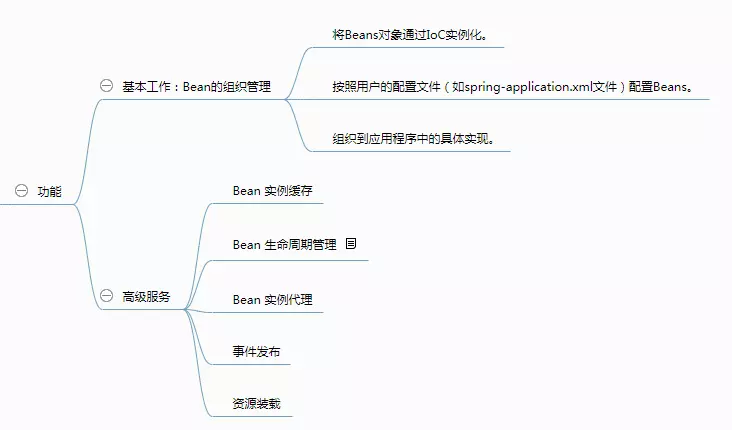
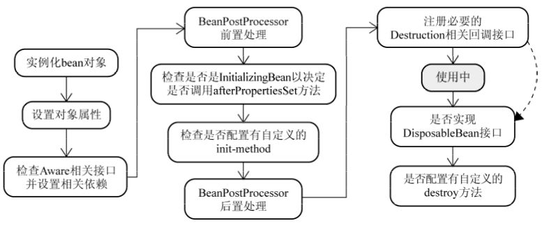

# Spring
https://wiki.jikexueyuan.com/project/spring/bean-definition.html
## 特性:
- 核心技术 ：依赖注入(DI)，AOP，事件(events)，资源，i18n，验证，数据绑定，类型转换，SpEL。
- 测试 ：模拟对象，TestContext框架，Spring MVC 测试，WebTestClient。
- 数据访问 ：事务，DAO支持，JDBC，ORM，编组XML。
- Web支持 : Spring MVC和Spring WebFlux Web框架。
- 集成 ：远程处理，JMS，JCA，JMX，电子邮件，任务，调度，缓存。
- 语言 ：Kotlin，Groovy，动态语言。
## 基本概念
- AOP：Aspect-oriented programming 面向切面编程：
    - 目的：Increase modularity by allowing the separation of cross-cutting concerns.
    - 方式：剖解开封装的对象内部，并将那些影响了多个类的公共行为封装到一个可重用模块，并将其名为“Aspect”，即切面。所谓“切面”，简单地说，就是将那些与业务无关，却为业务模块所共同调用的逻辑或责任封装起来，便于减少系统的重复代码，降低模块间的耦合度。
    - 切面（Aspect） 横切关注点的模块化（跨越应用程序多个模块的功能，比如 日志功能），这个关注点实现可能另外横切多个对象。
    - 连接点（Join point）： 连接点是在应用执行过程中能够插入切面的一个点。这个点可以是类的某个方法调用前、调用后、方法抛出异常后等。切面代码可以利用这些点插入到应用的正常流程之中，并添加行为。
    - 通知（Advice）： 在特定的连接点，AOP框架执行的动作。
        - 前置通知（Before）：在目标方法被调用之前调用通知功能。
        - 后置通知（After）：在目标方法完成之后调用通知，无论该方法是否发生异常。
        - 后置返回通知（After-returning）：在目标方法成功执行之后调用通知。
        - 后置异常通知（After-throwing）：在目标方法抛出异常后调用通知。
        - 环绕通知（Around）：通知包裹了被通知的方法，在被通知的方法调用之前和调用之后执行自定义的行为。

- IoC: Inversion of control 控制反转
    - IoC 是一种设计思想, Ioc意味着将你设计好的对象交给容器控制，而不是传统的在你的对象内部直接控制。
    - 通过控制反转，对象在被创建的时候，由一个调控系统内所有对象的外界实体，将其所依赖的对象的引用传递给它。也可以说，依赖被注入到对象中。

- DI:  Dependency Injection 依赖注入
    - 对对象的『依赖』是注入进来的，而和它的构造方式解耦了。构造它这个『控制』操作也交给了第三方，也就是控制反转。
    - a依赖b，但a不控制b的创建和销毁，仅使用b，那么b的控制权交给a之外处理，这叫控制反转（IOC），
    - a要依赖b，必然要使用b的instance，那么通过a的接口，把b传入；通过a的构造，把b传入；通过设置a的属性，把b传入；这个过程叫依赖注入（DI）。
```
        //例子 车子和引擎，创建一个引擎是200hp的车子的对象
        class Car{
            Engine e = new Engine() ;  
        }
        class Engine{
            Engine e = new Engine(200) ; //200马力
        }

        // 构造方法注入
        class Car{
            Engine e ;
            public Car(Engine e){
                this.e = e;
            };
        }

        // 工厂模式注入
        class Factory {
        /**
            * 通过msg来确定功率大小。工厂出一套规范。之后约束拓展在此类就可以进行
            **/
            public Engine getEngine(String msg){
                if(msg="200"){
                return new Engine(200) 
            }else if(msg="V8"){
                return new Engine("V8") 
                };
            };
        }

        class Car {
            Engine e ;
            void run(){
                Factory h = new Factory()；
                e=h.getEngine("V8"); //得到了V8引擎
                e=h.getEngine("200"); //得到200马力的引擎
            };
        }
```
## 容器：
- Spring用容器来实例化对象，管理对象之间的依赖。
- 接口：BeanFactory和ApplicationContex
- BeanFactory是最顶层最基本的接口，它描述了容器需要实现的最基本的功能，比如对象的注册，获取。
- ApplicationContext依赖BeanFactory接口，它描述的内容更加广泛，例如资源的获取等等。
- ClassPathXmlApplicationContext和FileSystemXmlApplicationContext
- FileSystemXmlApplicationContext在文件系统路径下寻找配置文件来实例化容器。
- 在web项目中，我们使用spring.xml——Spring的配置文件。


## 体系结构


### 核心容器
- 核心容器由核心，Bean，上下文和表达式语言模块组成，它们的细节如下：
    - 核心 模块提供了框架的基本组成部分，包括 IoC 和依赖注入功能。
    - Bean 模块提供 BeanFactory，它是一个工厂模式的复杂实现。
    - context 模块建立在由核心和 Bean 模块提供的坚实基础上，它是访问定义和配置的任何对象的媒介。ApplicationContext 接口是上下文模块的重点。
    - Spring Expression Language (SpEL) 模块在运行时提供了查询和操作一个对象图的强大的表达式语言。querying and manipulating an object graph at runtime

- 数据访问/集成
    - 数据访问/集成层包括 JDBC，ORM，OXM，JMS 和事务处理模块，它们的细节如下：
    - JDBC 模块提供了删除冗余的 JDBC 相关编码的 JDBC 抽象层。
    - ORM Object-relational mapping (对象关系映射) 模块为流行的对象关系映射 API，包括 JPA，JDO，Hibernate 和 iBatis，提供了集成层。
    - OXM object-xml mapping模块提供了抽象层，它支持对 JAXB，Castor，XMLBeans，JiBX 和 XStream 的对象/XML 映射实现。
    - Java Message Service Java 消息服务 JMS 模块包含生产和消费的信息的功能。
    - Transaction 事务模块为实现特殊接口的类及所有的 POJO 支持编程式和声明式事务管理。
- Web
    - Web 层由 Web，Web-MVC，Web-Socket 和 Web-Portlet 组成，它们的细节如下：
    - Web 模块提供了基本的面向 web 的集成功能，例如多个文件上传的功能和使用 servlet 监听器和面向 web 应用程序的上下文来初始化 IoC 容器。
    - Web-MVC 模块包含 Spring 的模型-视图-控制器（MVC），实现了 web 应用程序。
    - Web-Socket 模块为 WebSocket-based 提供了支持，而且在 web 应用程序中提供了客户端和服务器端之间通信的两种方式。
    - Web-Portlet 模块提供了在 portlet 环境中实现 MVC，并且反映了 Web-Servlet 模块的功能。
- 其他
- AOP 模块提供了面向方面的编程实现，允许你定义方法拦截器和切入点对代码进行干净地解耦，它实现了应该分离的功能。
- Aspects 模块提供了与 AspectJ 的集成，这是一个功能强大且成熟的面向切面编程（AOP）框架。
- Instrumentation 模块在一定的应用服务器中提供了类 instrumentation 的支持和类加载器的实现。
- Messaging 模块为 STOMP 提供了支持作为在应用程序中 WebSocket 子协议的使用。它也支持一个注解编程模型，它是为了选路和处理来自 WebSocket 客户端的 STOMP 信息。
- 测试模块支持对具有 JUnit 或 TestNG 框架的 Spring 组件的测试。


## Spring加载过程


## Bean 
- Bean是Spring框架在运行时管理的对象
- Bean 的管理包括：
    - 创建一个对象
    - 提供依赖项（例如其他bean，配置属性）
    - 拦截对象方法调用以提供额外的框架功能
    - 销毁一个对象

- 如何定义Spring bean
    - 使用构造型@Component注释（或其衍生物）注释你的类
    ```
        @Component
        class MySpringBeanClass {
            //...
        }
    ```
    在运行时，Spring会找到所有使用@Component或其派生类进行注释的类，并将它们用作bean定义。查找带注释的类的过程称为 **组件扫描**。
        - @Component衍生包括：@Service, @Repository, @Controller
    - 编写在自定义Java配置类中使用@Bean注释的bean工厂方法：
        - 工厂Bean: a bean that serves as a factory for creating other beans within the IoC container.

    - 在XML配置文件中声明bean定义


https://howtodoinjava.com/java-spring-framework-tutorials/


        