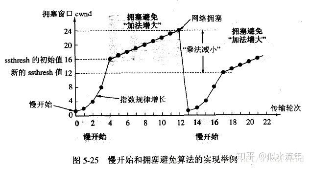
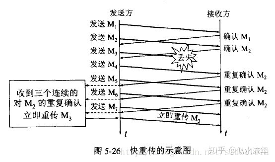
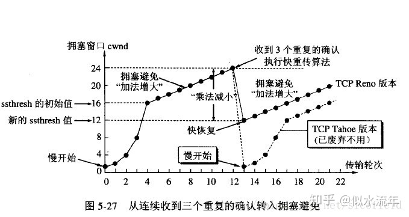
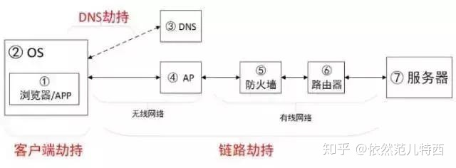
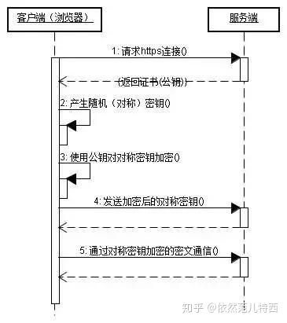
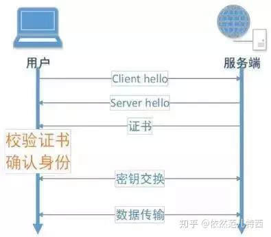

# 计算机网络 -TCP/IP HTTP协议等。


## OSI
- 应用层
- 表示层
- 会话层
- 传输层
- 网络层
- 数据链路层
- 物理层 

## TCP-IP
- 应用层：
    应用层决定了向用户提供应用服务时通信的活动。TCP/IP 协议族 内预存了各类通用的应用服务。比如，FTP（FileTransfer
    Protocol，文件传输协议）和 DNS（Domain Name System，域名系统）服务就是其中两类。HTTP 协议也处于该层。

- 传输层：
    传输层对上层应用层，提供处于网络连接中的两台计算机之间的数据传输。在传输层有两个性质不同的协议：TCP（Transmission Control Protocol，传输控制协议）和UDP（User Data Protocol，用户数据报协议）。

- 网络层：
        网络层用来处理在网络上流动的数据包。数据包是网络传输的最小数据单位。该层规定了通过怎样的路径（所谓的传输路线）到达对方计算机，并把数据包传送给对方。与对方计算机之间通过多台计算机或网络设备进行传输时，网络层所起的作用就是在众多的选项内选择一条传输路线。

- 链路层：
    用来处理连接网络的硬件部分。包括控制操作系统、硬件的设备驱动、NIC（Network Interface Card，网络适配器，即网卡），及光纤等物理可见部分（还包括连接器等一切传输媒介）。硬件上的范畴均在链路层的作用范围之内。

## IP协议
- 位于网络层
- 作用：把数据包发送给对方
- 要素： MAC地址和IP地址
    - MAC: 网卡所属的固定地址。一般不变。
    - IP: 指明了节点被分配到的地址。IP地址可变。IP 间的通信依赖MAC地址。
- 中转：采用 ARP 协议（Address Resolution Protocol）。ARP是一种用以解析地址的协议，根据通信方的 IP 地址就可以反查出对应的 MAC 地址。
- 反向地址转换协议，网络层协议。使知道自己硬件地址的主机可以获得IP地址。

## TCP协议
- TCP 位于传输层，提供一种面向连接的、可靠的字节流服务
- 在一个 TCP 连接中，仅有两方进行彼此通信。广播和多播不能用于 TCP
- TCP 使用校验和，确认和重传机制来保证可靠传输
- TCP 给数据分节进行排序，并使用累积确认保证数据的顺序不变和非重复
- TCP 使用滑动窗口机制来实现流量控制，通过动态改变窗口的大小进行拥塞控制
- TCP 并不能保证数据一定会被对方接收到，因为这是不可能的。TCP 能够做到的是，如果有可能，就把数据递送到接收方，否则就（通过放弃重传并且中断连接这一手段）通知用户。

## 三次握手与四次挥手

### 三次握手- 三次握手：
- 三次握手(Three-way Handshake)，是指建立一个 TCP 连接时，需要客户端和服务器总共发送3个包。
- 目的：
    - 是连接服务器指定端口，建立 TCP 连接，并同步连接双方的序列号和确认号，交换 TCP 窗口大小信息。在 socket 编程中，客户端执行 connect() 时。将触发三次握手。
    - 为了防止已失效的连接请求报文段突然又传送到了服务端，因而产生错误。
1. 第一次握手(SYN=1, seq=x):
客户端发送一个 TCP 的 SYN 标志位置1的包，指明客户端打算连接的服务器的端口，以及初始序号 X,保存在包头的序列号(Sequence Number)字段里。
发送完毕后，客户端进入 SYN_SEND 状态。
2. 第二次握手(SYN=1, ACK=1, seq=y, ACKnum=x+1):服务器发回确认包(ACK)应答。即 SYN 标志位和 ACK 标志位均为1。服务器端选择自己 ISN 序列号，放到 Seq 域里，同时将确认序号(Acknowledgement Number)设置为客户的 ISN 加1，即X+1。 发送完毕后，服务器端进入 SYN_RCVD 状态。
3. 第三次握手(ACK=1，ACKnum=y+1)客户端再次发送确认包(ACK)，SYN 标志位为0，ACK 标志位为1，并且把服务器发来 ACK 的序号字段+1，放在确定字段中发送给对方，并且在数据段放写ISN的+1
发送完毕后，客户端进入 ESTABLISHED 状态，当服务器端接收到这个包时，也进入 ESTABLISHED 状态，TCP 握手结束。

### 四次挥手
- TCP 的连接的拆除需要发送四个包，因此称为四次挥手(Four-way handshake)。客户端或服务器均可主动发起挥手动作，在 socket 编程中，任何一方执行 close() 操作即可产生挥手操作。

1. 第一次挥手(FIN=1，seq=x)
假设客户端想要关闭连接，客户端发送一个 FIN 标志位置为1的包，表示自己已经没有数据可以发送了，但是仍然可以接受数据。发送完毕后，客户端进入 FIN_WAIT_1 状态。
2. 第二次挥手(ACK=1，ACKnum=x+1)服务器端确认客户端的 FIN 包，发送一个确认包，表明自己接受到了客户端关闭连接的请求，但还没有准备好关闭连接。发送完毕后，服务器端进入 CLOSE_WAIT 状态，客户端接收到这个确认包之后，进入 FIN_WAIT_2 状态，等待服务器端关闭连接。
3. 第三次挥手(FIN=1，seq=y)服务器端准备好关闭连接时，向客户端发送结束连接请求，FIN 置为1。发送完毕后，服务器端进入 LAST_ACK 状态，等待来自客户端的最后一个ACK。
4.  第四次挥手(ACK=1，ACKnum=y+1)。客户端接收到来自服务器端的关闭请求，发送一个确认包，并进入 TIME_WAIT状态，等待可能出现的要求重传的 ACK 包。服务器端接收到这个确认包之后，关闭连接，进入 CLOSED 状态。客户端等待了某个固定时间（两个最大段生命周期，2MSL，2 Maximum Segment Lifetime）之后，没有收到服务器端的 ACK ，认为服务器端已经正常关闭连接，于是自己也关闭连接，进入 CLOSED 状态。

- 为什么要四次挥手
    - 第一次挥手：当主动方发送断开连接的请求（即FIN报文）给被动方时，仅仅代表主动方不会再发送数据报文了，但主动方仍可以接收数据报文。    
    - 第二次挥手： 被动方此时有可能还有相应的数据报文需要发送，因此需要先发送ACK报文，告知主动方“我知道你想断开连接的请求了”。这样主动方便不会因为没有收到应答而继续发送断开连接的请求（即FIN报文）。
    - 第三次挥手：被动方在处理完数据报文后，便发送给主动方FIN报文；这样可以保证数据通信正常可靠地完成。发送完FIN报文后，被动方进入LAST_ACK阶段（超时等待）。
    - 第四挥次挥手：如果主动方及时发送ACK报文进行连接中断的确认，这时被动方就直接释放连接，进入可用状态。

### 为什么不能两次握手：
 - 为了实现可靠传输，发送方和接收方始终需要同步( SYNchronize )序号。 需要注意的是， 序号并不是从 0 开始的， 而是由发送方随机选择的初始序列号 ( Initial Sequence Number, ISN )开始 。 由于 TCP 是一个双向通信协议， 通信双方都有能力发送信息， 并接收响应。 因此， 通信双方都需要随机产生一个初始的序列号， 并且把这个起始值告诉对方。
 

### TCP 流量控制与拥塞机制
- 流量控制
    <!-- 1. 目的：防止分组丢失。发送者发送数据过快，接收者来不及接收，那么就会有分组丢失。根据接收端能力来决定发送端的速度的机制叫做流量控制。
    2. 窗口大小：接收端向发送端主机通知自己可以接受的数据的大小。这个大小限制叫做窗口大小。
    3. 接收端将自己可以接受的缓冲区大小放TCP头部窗口大小字段。
    4. 由滑动窗口协议（连续ARQ协议）实现。滑动窗口协议既保证了分组无差错、有序接收，也实现了流量控制。主要的方式就是接收方返回的 ACK 中会包含自己的接收窗口的大小，并且利用大小来控制发送方的数据发送。
    5. 死锁：当发送者收到了一个窗口为0的应答，发送者便停止发送，等待接收者的下一个应答。但是如果这个窗口不为0的应答在传输过程丢失，发送者一直等待下去，而接收者以为发送者已经收到该应答，等待接收新数据，这样双方就相互等待，从而产生死锁。为了避免流量控制引发的死锁，TCP使用了持续计时器。每当发送者收到一个零窗口的应答后就启动该计时器。时间一到便主动发送报文询问接收者的窗口大小。若接收者仍然返回零窗口，则重置该计时器继续等待；若窗口不为0，则表示应答报文丢失了，此时重置发送窗口后开始发送，这样就避免了死锁的产生。 -->
    - 流量控制概念

    接收端处理数据的速度是有限的，如果发送方的速度太快，就会把缓冲区打满。这个时候如果继续发送数据，就会导致丢包等一系列连锁反应。 所以 TCP 支持根据接收端能力来决定发送端的发送速度。这个机制叫做流控制。
    - 流控制与窗口大小

    接收端主机向发送端主机通知自己可以接收数据的大小，该大小限度就被称作窗口大小。窗口大小的值就是由接收端主机决定的。
    
    - 窗口大小扩大因子M

    实际的窗口大小是窗口字段的值左移M位

    

- 拥塞控制和流量控制的区别
    1. 拥塞控制：拥塞控制是作用于网络的，它是防止过多的数据注入到网络中，避免出现网络负载过大的情况；常用的方法就是：（ 1 ）慢开始、拥塞避免（ 2 ）快重传、快恢复。
    2. 流量控制：流量控制是作用于接收者的，它是控制发送者的发送速度从而使接收者来得及接收，防止分组丢失的。

- TCP 拥塞控制：
    - 慢开始

        发送方维持一个叫做拥塞窗口cwnd（congestion window）的状态变量。拥塞窗口的大小取决于网络的拥塞程度，并且动态地在变化。发送方让自己的发送窗口等于拥塞窗口，另外考虑到接受方的接收能力，发送窗口可能小于拥塞窗口。
        慢开始思路: 不要一开始就发送大量的数据，先探测一下网络的拥塞程度，也就是说由小到大逐渐增加拥塞窗口的大小。
        - 初始化时 cwnd = 1.
        - 每当接收到一个ACK， cwnd ++， 线性上升
        - 每经过一个RTT, cwnd = cwnd*2， 指数上升
        - 阈值ssthreash(slow start threshold)是一个上线，当cwnd > ssthresh时就会进入拥塞避免算法。
    
    - 拥塞避免算法

        拥塞避免算法让拥塞窗口缓慢增长，即每经过一个往返时间RTT(Round-Trip Time) 就把发送方的拥塞窗口cwnd加1，而不是加倍。这样拥塞窗口按线性规律缓慢增长。 
        - 每当收到一个ACK， cwnd = cwnd + 1/cwnd
        - 每当过了一个RTT, cwnd = cwdn +1
        - 拥塞发生，当发生丢包进行数据包重传的时候，表示网络已经拥塞。
            1. 超时重传时间是以 RTO （Retransmission Timeout 超时重传时间）表示。
            2. ssthresh = cwnd /2
            3. cwnd 重置为 1
        - 核心：乘法减小（Multiplicative Decrease）和加法增大（Additive Increase）

        
    - 快重传算法

        接收方收到收到一个失序的报文段后就立即发出重复确认。 收到三个duplicate AKG后就重传，不用等到RTO超时。
        1. ssthresh = cwnd /2
        2. 进入快速恢复算法.

        
    
    - 快速恢复算法(至少收到三个duplicate AKGS,网络不是那么糟糕)
        
        当发送方连续收到三个重复确认时，就执行“乘法减小”算法，把ssthresh门限减半（为了预防网络发生拥塞）。但是接下去并不执行慢开始算法。考虑到如果网络出现拥塞的话就不会收到好几个重复的确认，所以发送方现在认为网络可能没有出现拥塞。所以此时不执行慢开始算法，而是将cwnd设置为ssthresh减半后的值，然后执行拥塞避免算法，使cwnd缓慢增大。如

        

    - TCP如何保证安全
        -  停止等待协议
            1. 每发送完一个分组，就停止发送，等待对方确认，收到确认后再发送下一个分组。
            2. 每发送一个分组就设置一个超时计时器，超时之后就重传。
            3. 确认丢失：
            确认丢失A要重传，B要再次确认
            4. 确认迟到：
                对于确认迟到，A要重传分组，对收到的迟到确认丢弃。B要再次确认分组，对收到的重复分组丢弃。
        - 连续 ARQ协议 -重传请求（Automatic Repeat-reQuest）
            - 利用滑动窗口，位于滑动窗口内的所有分组都能发出去。不需要逐个等待和确认。
                1. 策略A：每收到一个确认，酒吧发送窗口向前滑动一个分组的位置
                2. 策略B：采用累计确认的方式，对按序到达的最后一个分组发送确认，表示这个分组之前的都收到了。
                - 优点：信道利用效率高，容易实现，及时丢失确认也不必重传。
            - 回退N重传(Go-Back-N)
                1. 接收点丢弃从第一个没有收到的数据包开始的所有数据包。
                2. 发送点收到NACK后，从NACK中指明的数据包开始重新发送。
            - 选择重传(Selective Repeat)
                1. 发送点连续发送数据包但对每个数据包都设有个一个计时器。
                2. 当在一定时间内没有收到某个数据包的ACK时，发送点只重新发送那个没有ACK的数据包。 

## TCP头部字段
- source port（源端口） 16bit：源主机的应用程序端口号
- destinationport(目标端口)： 16Bit:目标主机的应用程序的端口号
- sequence number（序列号）: 32Bit: 发送单发出的不同的TCP数据段的序号，数据段在网络传输时，顺序有可能会发生变化。接收端一句序列号按照正确的顺序重组数据。
- acknowledge number（确认序列号）： 32Bit：用于表示接收端收到的数据段，确认序列号为成功接受的数据段的序列号+1
- header length(TCP头部长度)：60Bit：正常情况下 20Bit,如果加上option选徐昂，最长为60Bit
- flag(标志位)： 10Bit,URG 表示紧急指针，ACK表示对于SYN的确认， SYN表示对于request的确认报文，FIN字段在传输完成断开连接的时候使用。
- window（窗口的的大小）：16Bit,表示主机的缓冲区最大多少bytes.最大值是65525 Bytes,用来进行流量控制。
- checksum（校验和），教研整个TCP数据段，包括TCP头部与TCP数据，发送端进行计算的记录，接收端进行验证。

## TCP什么时候发复位包
- 重置连接，复位连接，用来关闭异常的连接。
- 不必等缓冲区的包都发出去，直接丢丢弃缓冲区中的包，发送RST(reset)
- 而接收到RST包后，也不必发送ACK包来确认
- 到不存在的端口的连接请求

    异常终止一个连接
    
    检测半打开的连接

- 什么时候发送 RST包
    1. 建立连接的SYN叨叨某端口，但是该端口上没有正在监听的服务
    2. TCP收到了一个根本不存在的连接上的分节
    3. 请求超时。使用setsockopt 的SO_RCVTIMEO选项设施recv的超时时间，接受数据超时的时候发送RST包
- 尝试手动发送 RST包
    1. 使用 shutdown, close关闭套接字，发送的是FIN不是RST
    2. 套接字关闭前，使用sleep。对运行的程序CTRL+C，会发送FIN，不是RST。
    3. 套接字关闭前，执行 return , exit(0),exit(1)。对运行的程序CTRL+C，会发送FIN，不是RST。

## TCP & UDP
- TCP面向连接（如打电话要先拨号建立连接）
- UDP是无连接的，发送数据前不需要建立连接。
- TCP 提供可靠的服务，通过TCP传输的数据无差错，不丢失，不重复，且按需到达，
- UDP尽最大努力交付，即不保证可靠交付。

## TCP心跳包机制:
- 我们采用的思路是：客户端连接上服务端以后，服务端维护一个在线用户字典，客户端每隔一段时间，向服务器发送一个心跳包，服务器接收到包以后，字典数据的值都会更新为0；一旦服务端超过规定时间没有接收到客户端发来的包，字典数据将会递增加一，当字典数据的值累计大于等于三，则视为掉线。

## HTTP & HTTPS：
- HTTP和HTTPS的基本概念

    1. HTTP：是互联网上应用最为广泛的一种网络协议，是一个客户端和服务器端请求和应答的标准（TCP），用于从WWW服务器传输超文本到本地浏览器的传输协议，它可以使浏览器更加高效，使网络传输减少。
    2. HTTPS：是以安全为目标的HTTP通道，简单讲是HTTP的安全版，即HTTP下加入SSL层，HTTPS的安全基础是SSL，因此加密的详细内容就需要SSL。
    3. HTTPS协议的主要作用可以分为两种：一种是建立一个信息安全通道，来保证数据传输的安全；另一种就是确认网站的真实性。

- HTTP 的安全风险
    1. 隐私泄露：由于 HTTP 本身是明文传输，用户和服务端之间的传输内容都能被中间者查看。也就是说 你在网上搜索、购物、访问的网点、点击的页面等信息，都可以被「中间人」获取。

    2. 页面劫持：隐私泄露的风险比较隐蔽，用户基本感知不到。但另外一类劫持的影响就非常明显非常直接了——页面劫持，也就是直接篡改用户的浏览页面。
- HTTP劫持分类
    - 根据劫持路径分类：DNS 劫持、客户端劫持、链路劫持。

    


- HTTPS与Web服务器通信时的几个步骤

1. 客户使用https的URL访问Web服务器，要求与Web服务器建立SSL连接。

2. Web服务器收到客户端请求后，会将网站的证书信息（证书中包含公钥）传送一份给客户端。

3. 客户端的浏览器与Web服务器开始协商SSL连接的安全等级，也就是信息加密的等级。

4. 客户端的浏览器根据双方同意的安全等级，建立会话密钥，然后利用网站的公钥将会话密钥加密，并传送给网站。

5. Web服务器利用自己的私钥解密出会话密钥。

6. Web服务器利用会话密钥加密与客户端之间的通信。
    

- HTTPS的优点

1. 身份认证：使用HTTPS协议可认证用户和服务器，确保数据发送到正确的客户机和服务器。
2. 内容加密——防窃听：HTTPS协议是由SSL+HTTP协议构建的可进行加密传输、身份认证的网络协议，要比http协议安全，可防止数据在传输过程中不被窃取。
3. 一致性校验——防篡改：通过对数据和共享密钥的 MAC 码来防止中间者篡改消息内容，确保数据的一致性。
4. HTTPS网络传输安全系数相对较高，可以大幅增加中间人攻击的成本。



## HTTPS的缺点

1. 速度慢
    1. 网络耗时：由于协议的规定，必须要进行的网络传输。比如 SSL 完全握手，302 跳转等。HTTPS协议握手阶段比较费时，会使页面的加载时间延长近50%，增加10%到20%的耗电。

    2. 计算耗时：无论是客户端还是服务端，都需要进行对称加解密，协议解析，私钥计算，证书校验等计算，增加大量的计算时间。

2. HTTPS连接缓存不如HTTP高效，会增加数据开销和功耗，甚至已有的安全措施也会因此而受到影响；
3. 成本较高

    1. 服务器成本：HTTPS 的私钥计算会导致服务端性能的急剧下降，甚至不到 HTTP 协议的十分之一，也就是说，如果 HTTP 的性能是 10000cps，HTTPS 的性能可能只有几百 cps，会增加数倍甚至数十倍的服务器成本。

    2. 证书成本：根据证书个数及证书类型，一年可能需要花费几百到几百万不等的证书成本。

    3. 开发和运维成本：HTTPS 协议比较复杂，包括协议的配置，证书的更新，过期监控，客户端的兼容等一系列问题都需要具备专业背景的技术人员跟进处理。


## HTTPS和HTTP的主要区别

1. https协议需要申请证书，一般免费证书较少，因而需要一定费用。
2. http是超文本传输协议，信息是明文传输，https则是具有安全性的ssl加密传输协议。
3. http和https使用的是完全不同的连接方式，用的端口也不一样，前者是80，后者是443。
4. http的连接很简单，是无状态的；HTTPS协议是由SSL+HTTP协议构建的可进行加密传输、身份认证的网络协议，比http协议安全。

## 完整的HTTP请求
- 域名解析 --> 发起TCP的3次握手 --> 建立TCP连接后发起http请求 --> 服务器响应http请求，浏览器得到html代码 --> 浏览器解析html代码，并请求html代码中的资源（如js、css、图片等） --> 浏览器对页面进行渲染呈现给用户。

## 加密方式
- 对称加密：指的就是加、解密使用的**同一串密钥**，所以被称做对称加密。对称加密只有一个密钥作为私钥。常见的对称加密算法：DES，AES等。

- 非对称加密：指的是加、解密使用**不同的密钥**，一把作为公开的公钥，另一把作为私钥。公钥加密的信息，只有私钥才能解密。反之，私钥加密的信息，只有公钥才能解密。 举个例子，你向银行求公钥，服务器将公钥发给你，你使用公钥对消息加密，那么只有私钥的持有人才能对你的消息解密。与对称加密不同的是，公司服务器不需要将私钥通过网络发送出去，因此安全性大大提高。

- 最常用的非对称加密算法：RSA

- 对称加密优缺点：
    - 优点： 对称加密的加解密的效率要高得多、加密速度快。
    - 缺点： 但是缺陷在于对于密钥的管理和分发上比较困难，不是非常安全，密钥管理负担很重。
- 非对称加密优缺点：
    - 优点：安全性更高，公钥是公开的，密钥是自己保存的，不需要将私钥给别人。
    - 缺点：加密和解密花费时间长、速度慢，只适合对少量数据进行加密。

- SSL 协议 (HTTP+SSL=HTTPS)
    - 通信双方通过对称加密来加密密文，然后使用非对称加密的方式来传递对称加密所使用的密钥。这样效率和安全就都能保证了。
    - SSL协议的握手过程
        1. Alice需要在银行的网站做一笔交易，她的浏览器首先生成了一个随机数作为对称密钥。
        2. Alice的浏览器向银行的网站请求公钥。
        3. 银行将公钥发送给Alice。
        4. Alice的浏览器使用银行的公钥将自己的对称密钥加密。
        5. Alice的浏览器将加密后的对称密钥发送给银行。
        6. 银行使用私钥解密得到Alice浏览器的对称密钥。
        7. Alice与银行可以使用对称密钥来对沟通的内容进行加密与解密了。


## DNS
- DNS Domain Name System
    将主机域名转换为ip地址，属于应用层协议，使用UDP传输。

# 计算机网络 - session, cookie, 请求等。

# 计算机网络 - Security。

## SQL攻击
- 攻击者在HTTP请求中注入恶意的SQL代码，服务器使用参数构建数据库SQL命令时，恶意SQL被一起构造，并在数据库中执行。

- 例子： 用户登录，输入用户名 "AAA"，密码 'or '1' = '1  ，如果此时使用参数构造的方式，就会出现
select * from user where name = 'AAA' and password = '' or '1'='1'
不管用户名和密码是什么内容，使查询出来的用户列表不为空。
- 如何防范SQL注入攻击使用预编译的PrepareStatement是必须的，但是一般我们会从两个方面同时入手。
    - Web端
    1. 有效性检验。(比如react中的 PropTypes 提供一系列验证器，可用于确保组件接收到的数据类型是有效的. 例如：name : PropTypes.string)
    2. 限制字符串输入的长度。
    - 服务端
    3. 不用拼接SQL字符串。
    4. 使用预编译的Prepare Statement。
    5. 有效性检验。(为什么服务端还要做有效性检验？第一准则，外部都是不可信的，防止攻击者绕过Web端请求)
        例如定义  XXXValidate 的接口，返回True才使用接受的数据。
    6. 过滤SQL需要的参数中的特殊字符。比如单引号、双引号。


## XSS攻击 (Cross Site Scripting)

- 跨站点脚本攻击，指攻击者通过篡改网页，嵌入恶意脚本程序，在用户浏览网页时，控制用户浏览器进行恶意操作的一种攻击方式。如何防范XSS攻击.
- 反射型XSS。也就是攻击相对于访问者而言是一次性的。
- 储存型XSS。它与反射型XSS最大的不同就是服务器再接收到我们的恶意脚本时会将其做一些处理。
- 例子：在留言板输入\<script>alert(“hey!you are attacked”)\</script>,会导致弹窗 "Hey you are attacked"
```
    <html>
        <head>
        <title>留言板</title>
        </head>
    <body>
    <div id=”board” 
            <script>alert(“hey!you are attacked”)</script>
    </div>     
        </body>
</html>
```
- 危害：
- 盗用cookie实现无密码登录, 登录完成后服务器返回cookie。 ```document.cookie```
- 劫持流量实现恶意跳转 ```<script>window.location.href="http://www.baidu.com";</script>```

- 如何阻止
    - 前端，服务端，同时需要字符串输入的长度限制。
    - 前端，服务端，同时需要对HTML转义处理。将其中的”<”,”>”等特殊字符进行转义编码。
    - 主动闭合标签实现注入代码```<script>var $a = "";alert("xxxxx");"";</script>```
    - 防 XSS 的核心是必须对输入的数据做过滤处理。
    - 首先是过滤。对诸如\<script>、\、\<a>等标签进行过滤。
    - 其次是编码。像一些常见的符号，如<>在输入的时候要对其进行转换编码，这样做浏览器是不会对该标签进行解释执行的，同时也不影响显示效果。


## 什么是CSRF攻击。
- CSRF（Cross-site request forgery），中文名称：跨站请求伪造。攻击者盗用了你的身份，以你的名义发送恶意请求。
- CSRF的原理：CSRF攻击利用网站对于用户网页浏览器的信任，挟持用户当前已登陆的Web应用程序，去执行并非用户本意的操作。
- 过程
    1. 用户C打开浏览器，访问受信任网站A，输入用户名和密码请求登录网站A；
    2. 在用户信息通过验证后，网站A产生Cookie信息并返回给浏览器，此时用户登录网站A成功，可以正常发送请求到网站A；
    3. 用户未退出网站A之前，在同一浏览器中，打开一个TAB页访问网站B；
    4. 网站B接收到用户请求后，返回一些攻击性代码，并发出一个请求要求访问第三方站点A.
    5. 浏览器在接收到这些攻击性代码后，根据网站B的请求，在用户不知情的情况下携带Cookie信息，向网站A发出请求。网站A并不知道该请求其实是由B发起的，所以会根据用户C的Cookie信息以C的权限处理该请求，导致来自网站B的恶意代码被执行。 

- 条件
    - 登录受信任的网站A，并在本地生成Cookie。
    - 在不登出A的情况下，访问危险网站B。
- CSRF防御原理
    - 对用户凭证"进行校验处理"。 
    1. 签名校验，并对数据进行生命周期时间管理，就是数据过期管理。创建Token处理机制，Token数据结构与时间、加密签名直接相关
        - Token构成：
            - 消息(msg)：而msg本身也有两部分组成：一部分：随机字符串，过期时间戳。
            - 分割符(separator)：用于分隔msg部分与加密后生成的signature签名部分，这里用的是”.“
            - 签名(signature):signature。signature签名，是对“msg消息”用特定算法进行加密后的串。
            - | msg | separator | signature | key | timestamp | . | Base64(sha256(msg)) |
        - Token的加密
            - sha256散列算法+base64格式转换。加入过期时间的设定，token国企服务器不处理请求。
        - Token的验证校验：
            - 当用户向服务提出访问请求时，产生Token再提交给服务器的时候，服务器需要判断token的有效性（是否过期，签名有效），一旦传向服务器的请求中的Token异常，就可以判定是可疑行为不做处理，返回异常提示

    2. 验证HTTP Referer字段
        - 根据 HTTP 协议，在 HTTP 头中有一个字段叫 Referer，它记录了该 HTTP 请求的来源地址。
        - 在通常情况下，访问一个安全受限页面的请求来自于同一个网站，比如上文中用户User想要在网站WebA中进行转账操作，那么用户User
            1. 必须先登录WabA
            2. 然后再通过点击页面上的按钮出发转账事件
            - 这时该转帐请求的 Referer 值就会是转账按钮所在的页面的URL，而如果黑客要对银行网站实施 CSRF攻击，他只能在他自己的网站构造请求，当用户User通过黑客的网站发送请求到WebA时，该请求的 Referer 是指向黑客自己的网站。
    
    3. 只使用JSON API
        - 使用JavaScript发起AJAX请求是限制跨域的，并不能通过简单的 **\<form>** 表单来发送JSON，所以，通过只接收JSON可以很大可能避免CSRF攻击。


## 文件上传漏洞
- 文件上传漏洞，指的是用户上传一个可执行的脚本文件，并通过此脚本文件获得了执行服务端命令的能力。
- 阻止方法
    1. 判断文件类型。在判断文件类型的时候，可以结合使用MIME Type，后缀检查等方式。（可以将可执行文件改为图片等，所以不能只用后缀检查）
    2. 对上传的文件类型进行白名单校验。
    3. 上传的文件需要进行重新命名，使攻击者无法猜想上传文件的访问路径，
    4. 限制上传文件的大小。
    5. 单独设置文件服务器的域名。

## DDos (Distributed Denial of Service): 分布式拒绝服务
- 定义：攻击者利用利用网络节点资源如：IDC服务器、个人PC、手机、智能设备、打印机、摄像头等对目标发起大量攻击请求，大规模消耗目标网站的主机资源，让它无法正常服务。
DDos 
- 分类：
    - 资源消耗类攻击：通过大量请求消耗正常的带宽和协议栈处理资源的能力。Syn Flood、Ack Flood、UDP Flood。
    - 服务消耗性攻击：服务端始终处理高消耗型的业务的忙碌状态。数据服务的检索，文件服务的下载等。
    - 反射类攻击
- 防御： 
    - 异常流量的清洗过滤：硬件防火墙对异常流量的清洗过滤通过数据包的规则过滤。
    - 分布式集群防御: 在每个节点服务器配置多个IP地址，如一个节点受攻击无法提供服务，系统将会根据设置自动切换另一个节点并将攻击者的数据包全部返回发送点.


## Get 与 POST
|操作|GET|POST|
|---------|---------|---------|
后退按钮/刷新|无害|数据会被重新提交（浏览器应该告知用户数据会被重新提交）。
书签|可收藏为书签|不可收藏为书签|
缓存|能被缓存|不能缓存|
编码类型|application/x-www-form-urlencoded|application/x-www-form-urlencoded 或 multipart/form-data。为二进制数据使用多重编码。
历史|参数保留在浏览器历史中|参数不会保存在浏览器历史中。
对数据长度的限制|是的。当发送数据时，GET 方法向 URL 添加数据；URL 的长度是受限制的（URL 的最大长度是 2048 个字符）。|无限制。
对数据类型的限制|只允许 ASCII 字符。|没有限制。也允许二进制数据。
安全性|GET 的安全性较差，因为所发送的数据是 URL 的一部分。在发送密码或其他敏感信息时绝不要使用 GET ！|POST 比 GET 更安全，因为参数不会被保存在浏览器历史或 web 服务器日志中。
可见性|数据在 URL 中对所有人都是可见的。|数据不会显示在 URL 中。

- **如果必须做从客户端到服务器的端端加密。业界的通行做法就是https**
- **具体看RESTFUL框架**对于GET、POST、PUT、DELETE等的描述。


# Session, Cookie, and Token
## 需要cookie和session的原因
- http协议无状态的协议，每次请求都需要新的请求 无法维持一个用户 的状态。
- cookie是来自浏览器，保存在浏览器的键值对，主要应用于用户登陆。
- session服务端端每一个session维护一份会话信息数据，客户端和服务端依靠一个全局唯一标识sesssion_id来访问会话信息数据。用户访问web应用时，服务端程序决定何时创建session。


## Cookie
- 作用： 
    1. 识别用户身份。比如当A访问服务器时候，会被返回一段数据[id=1], 当再次访问的时候带上[id=1]。B访问服务器，则会被安排新的id
    2. 记录历史。例如在购物车加入商品时，JS可以修改cookie字段 [cart = itemA,itemB]。这样以后访问，购物车里面的物品不会被删除。

- cookie属性：
    - secure: Cookie通信只限于加密传输，指示浏览器仅仅在通过安全/加密连接才能使用该Cookie
    - httponly: 指示浏览器不要在除HTTP（和 HTTPS)请求之外暴露Cookie。不可以用document.cookie来获取cookie


- 添加 cookie:
    - Django
```
# django httpResponse有 set_cookie()方法
HttpResponse.set_cookie(
    key, value='', max_age=None, expires=None, path='/', 
    domain=None, secure=None, httponly=False, samesite=None
) :

# django request object 有 cookies 属性,该属性是一个字典
request.COOKIES[‘cookie_name’]

# 例子 first visit: set cookie [team] = barcelona, next visit, will send the cookie to server.
# cookie will be deleted when brower is closed if max_age is not set
def test_cookie(request):   
    if not request.COOKIES.get('team'):
        response = HttpResponse("Visiting for the first time.")
        response.set_cookie('team', 'barcelona')
        return response
    else:
        return HttpResponse("Your favorite team is {}".format(request.COOKIES['team']))
# so if the cookie's team attribute is set to Barcelona, it will return Your favorite team is Barcelona

# delete cookie:
    response.delete_cookie('cookie_name')
# update cookie:
    There is no cookie update method in HttpResponse, 
    use set_cookie() to update the cookie value or expiry time.

Never ever use cookies to store sensitive data like passwords. Cookies store data in plain text, as a result, anybody can read/modify them.

```
```
// Get Cookies:
@GetMapping("/")
public String readCookie(@CookieValue(value = "username", defaultValue = "Atta") String username) {
    return "Hey! My username is " + username;
}

// Add cookie
@GetMapping("/login")
@ResponseBody
public ResponseEntity<?> login(@RequestBody String credentials, HttpServletResponse response) {

    // create a cookie
    Cookie cookie = new Cookie("platform","mobile");

    // expires in 7 days
    cookie.setMaxAge(7 * 24 * 60 * 60);

    // optional properties
    cookie.setSecure(true);
    cookie.setHttpOnly(true);  
    cookie.setPath("/");

    // add cookie to response
    response.addCookie(cookie);
}

// Delete Cookie:

1. 将Cookie的值设置为null
Cookie cookie = new Cookie("username", null);
2. 将`Max-Age`设置为0
cookie.setMaxAge(0);
response.addCookie(cookie);

```

## Session
