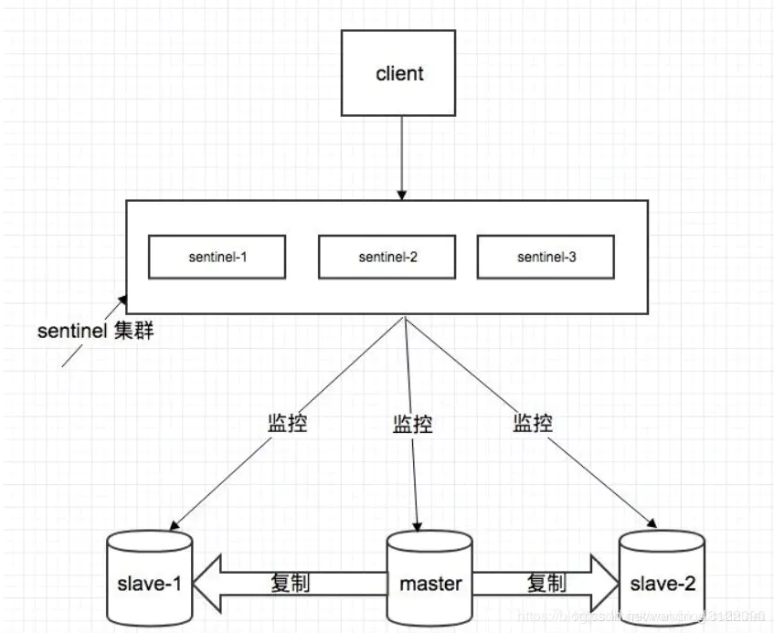
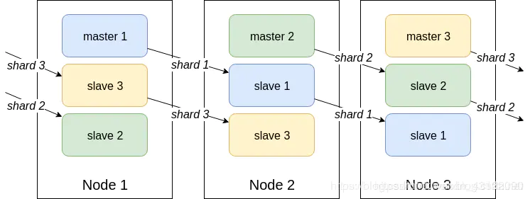
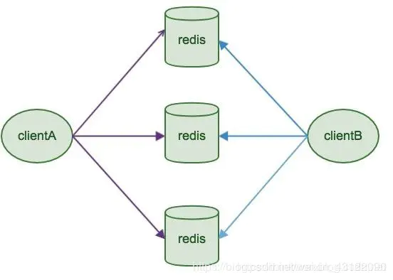

## 基本概念
- 什么是Redis？
    - Redis 是一个使用 C 语言写成的，开源的高性能key-value非关系缓存数据库。它支持存储的value类型相对更多，包括string(字符串)、list(链表)、set(集合)、zset(sorted set --有序集合)和hash（哈希类型）。Redis的数据都基于缓存的，所以很快，每秒可以处理超过 10万次读写操作，是已知性能最快的Key-Value DB。Redis也可以实现数据写入磁盘中，保证了数据的安全不丢失，而且Redis的操作是原子性的。(原子操作：指不会被线程调度机制打断的操)

- 优点
    - 读写性能优异， Redis能读的速度是110000次/s，写的速度是81000次/s。
    - 支持数据持久化，支持AOF和RDB两种持久化方式。
    - 支持事务，Redis的所有操作都是原子性的，同时Redis还支持对几个操作合并后的原子性执行。
    - 数据结构丰富，除了支持string类型的value外还支持hash、set、zset、list等数据结构。
    - 支持主从复制，主机会自动将数据同步到从机，可以进行读写分离。

- 缺点
    - 数据库容量受到物理内存的限制，不能用作海量数据的高性能读写，因此Redis适合的场景主要局限在较小数据量的高性能操作和运算上。
    - Redis 不具备自动容错和恢复功能，主机从机的宕机都会导致前端部分读写请求失败，需要等待机器重启或者手动切换前端的IP才能恢复。
    - 主机宕机，宕机前有部分数据未能及时同步到从机，切换IP后还会引入数据不一致的问题，降低了系统的可用性。
    - Redis 较难支持在线扩容，在集群容量达到上限时在线扩容会变得很复杂。为避免这一问题，运维人员在系统上线时必须确保有足够的空间，这对资源造成了很大的浪费。

- 使用redis有哪些好处？
    - 速度快，因为数据存在内存中，类似于HashMap，HashMap的优势就是查找和操作的时间复杂度都很低
    - 支持丰富数据类型，支持string，list，set，sorted set，hash
    - 支持事务，操作都是原子性，所谓的原子性就是对数据的更改要么全部执行，要么全部不执行
    - 丰富的特性：可用于缓存，消息，按key设置过期时间，过期后将会自动删除

- 为什么要用 Redis / 为什么要用缓存
    - 高性能：
        - 假如用户第一次访问数据库中的某些数据。这个过程会比较慢，因为是从硬盘上读取的。将该用户访问的数据存在数缓存中，这样下一次再访问这些数据的时候就可以直接从缓存中获取了。操作缓存就是直接操作内存，所以速度相当快。如果数据库中的对应数据改变的之后，同步改变缓存中相应的数据即可！
    - 高并发
        - 直接操作缓存能够承受的请求是远远大于直接访问数据库的，所以我们可以考虑把数据库中的部分数据转移到缓存中去，这样用户的一部分请求会直接到缓存这里而不用经过数据库。
- Redis为什么这么快
    - 完全基于内存，绝大部分请求是纯粹的内存操作，非常快速。数据存在内存中，类似于 HashMap，HashMap 的优势就是查找和操作的时间复杂度都是O(1)；
    - 数据结构简单，对数据操作也简单，Redis 中的数据结构是专门进行设计的；
    - 采用单线程，避免了不必要的上下文切换和竞争条件，也不存在多进程或者多线程导致的切换而消耗 CPU，不用去考虑各种锁的问题，不存在加锁释放锁操作，没有因为可能出现死锁而导致的性能消耗；
    - 使用多路 I/O 复用模型，非阻塞 IO；
    - 使用底层模型不同，它们之间底层实现方式以及与客户端之间通信的应用协议不一样，Redis 直接自己构建了 VM 机制 ，因为一般的系统调用系统函数的话，会浪费一定的时间去移动和请求；
    - 同步与异步
        - 同步： 就是在发出一个调用时，在没有得到结果之前，该调用就不返回
        - 异步： 调用在发出之后，这个调用就直接返回了。被调用者通过状态、通知来通知调用者，或通过回调函数处理这个调用。

    - 阻塞与非阻塞

- Redis 有哪些数据结构？
    - 字符串 String、字典 Hash、列表 List、集合 Set、有序集合 SortedSet。
|数据类型|可以存储的值|操作|应用场景|
|---	            |---	            |---	            |---	|
|   String  |   字符串、整数或者浮点数   |   对整个字符串或者字符串的其中一部分执行操作 对整数和浮点数执行自增或者自减操作	|   做简单的键值对缓存	|
|   List    |   列表                |  对单个或者多个元素进行修剪，只保留一个范围内的元素 	|  存储一些列表型的数据结构，类似粉丝列表、文章的评论列表之类的数据 	|
|   Set     |  无序集合	 	| 添加、获取、移除单个元素, 检查一个元素是否存在于集合中, 计算交集、并集、差集 从集合里面随机获取元素  	|   交集、并集、差集的操作，比如交集，可以把两个人的粉丝列表整一个交集	|
|Hash   |包含键值对的无序散列表 |添加、获取、移除单个键值对,获取所有键值对, 检查某个键是否存在 | 结构化的数据，比如一个对象	|
|ZSet   |无序集合 |添加、获取、删除元素.根据分值范围或者成员来获取元素。计算一个键的排名 | 去重但可以排序。如获取排名前几名的用户。	|

    - HyperLogLog(做基数统计，HyperLogLog 比如数据集 {1, 3, 5, 7, 5, 7, 8}， 那么这个数据集的基数集为 {1, 3, 5 ,7, 8} )， 
    - GEO 主要用于存储地理位置信息，并对存储的信息进行操作

- 应用场景

    - 计数器
        - 可以对 String 进行自增自减运算，从而实现计数器功能。Redis 这种内存型数据库的读写性能非常高，很适合存储频繁读写的计数量。
    - 缓存
        - 将热点数据放到内存中，设置内存的最大使用量以及淘汰策略来保证缓存的命中率。

    - 会话缓存
        - 可以使用 Redis 来统一存储多台应用服务器的会话信息。当应用服务器不再存储用户的会话信息，也就不再具有状态，一个用户可以请求任意一个应用服务器，从而更容易实现高可用性以及可伸缩性。
    - 全页缓存（FPC）
        - 除基本的会话token之外，Redis还提供很简便的FPC平台。以Magento为例，Magento提供一个插件来使用Redis作为全页缓存后端。此外，对WordPress的用户来说，Pantheon有一个非常好的插件 wp-redis，这个插件能帮助你以最快速度加载你曾浏览过的页面。
    - 查找表
        - 例如 DNS 记录就很适合使用 Redis 进行存储。查找表和缓存类似，也是利用了 Redis 快速的查找特性。但是查找表的内容不能失效，而缓存的内容可以失效，因为缓存不作为可靠的数据来源。
    - 消息队列(发布/订阅功能)
        - List 是一个双向链表，可以通过 lpush 和 rpop 写入和读取消息。不过最好使用 Kafka、RabbitMQ 等消息中间件。
    - 分布式锁实现
        - 在分布式场景下，无法使用单机环境下的锁来对多个节点上的进程进行同步。可以使用 Redis 自带的 SETNX 命令实现分布式锁，除此之外，还可以使用官方提供的 RedLock 分布式锁实现。
    - 其它
        - Set 可以实现交集、并集等操作，从而实现共同好友等功能。
        - ZSet 可以实现有序性操作，从而实现排行榜等功能。

- 持久化
    - 持久化就是把内存的数据写到磁盘中去，防止服务宕机了内存数据丢失。
    - 两种持久化机制 RDB（默认） 和 AOF 机制:
    - RDB：是Redis DataBase缩写快照。
        - 优点：
            1.  只有一个文件 dump.rdb，方便持久化。
            2. 容灾性好，一个文件可以保存到安全的磁盘。
            3. 性能最大化，fork 子进程来完成写操作，让主进程继续处理命令，所以是 IO 最大化。使用单独子进程来进行持久化，主进程不会进行任何 IO 操作，保证了 redis 的高性能
            4. 相对于数据集大时，比 AOF 的启动效率更高。
        - 缺点：
            1. 数据安全性低。RDB 是间隔一段时间进行持久化，如果持久化之间 redis 发生故障，会发生数据丢失。所以这种方式更适合数据要求不严谨的时候)
            2. AOF（Append-only file)持久化方式： 是指所有的命令行记录以 redis 命令请 求协议的格式完全持久化存储)保存为 aof 文件。
    - AOF Append Only File持久化:
        - 将Redis执行的每次写命令记录到单独的日志文件中，当重启Redis会重新将持久化的日志中文件恢复数据。
        - 当两种方式同时开启时，数据恢复Redis会优先选择AOF恢复
        - 优点：
            1. 数据安全，aof 持久化可以配置 appendfsync 属性，有 always，每进行一次 命令操作就记录到 aof 文件中一次。
            2. 通过 append 模式写文件，即使中途服务器宕机，可以通过 redis-check-aof 工具解决数据一致性问题。
            3. AOF 机制的 rewrite 模式。AOF 文件没被 rewrite 之前（文件过大时会对命令 进行合并重写），可以删除其中的某些命令（比如误操作的 flushall）)
        - 缺点：
            1. AOF 文件比 RDB 文件大，且恢复速度慢。
            2. 数据集大的时候，比 rdb 启动效率低。
    - 比较
        - AOF文件比RDB更新频率高，优先使用AOF还原数据。
        - AOF比RDB更安全也更大
        - RDB性能比AOF好
        - 如果两个都配了优先加载AOF

- Redis的过期键的删除策略
    - 定时过期：每个设置过期时间的key都需要创建一个定时器，到过期时间就会立即清除。该策略可以立即清除过期的数据，对内存很友好；但是会占用大量的CPU资源去处理过期的数据，从而影响缓存的响应时间和吞吐量。
    - 惰性过期：只有当访问一个key时，才会判断该key是否已过期，过期则清除。该策略可以最大化地节省CPU资源，却对内存非常不友好。极端情况可能出现大量的过期key没有再次被访问，从而不会被清除，占用大量内存。
    - 定期过期：每隔一定的时间，会扫描一定数量的数据库的expires字典中一定数量的key，并清除其中已过期的key。该策略是前两者的一个折中方案。通过调整定时扫描的时间间隔和每次扫描的限定耗时，可以在不同情况下使得CPU和内存资源达到最优的平衡效果。

- Redis key的过期时间和永久有效分别怎么设置？
    - expire和persist命令。

- 我们知道通过expire来设置key 的过期时间，那么对过期的数据怎么处理呢?

    - 除了缓存服务器自带的缓存失效策略之外（Redis默认的有6中策略可供选择），我们还可以根据具体的业务需求进行自定义的缓存淘汰，常见的策略有两种：
        1. 定时去清理过期的缓存；
        2. 当有用户请求过来时，再判断这个请求所用到的缓存是否过期，过期的话就去底层系统得到新数据并更新缓存。

- MySQL里有2000w数据，redis中只存20w的数据，如何保证redis中的数据都是热点数据
    - redis内存数据集大小上升到一定大小的时候，就会施行数据淘汰策略。

- 内存淘汰策略有哪些
    - Redis的内存淘汰策略是指在Redis的用于缓存的内存不足时，怎么处理需要新写入且需要申请额外空间的数据。
    - Redis的内存淘汰策略的选取并不会影响过期的key的处理。内存淘汰策略用于处理内存不足时的需要申请额外空间的数据；过期策略用于处理过期的缓存数据。
    - 全局的键空间选择性移除
        - noeviction：当内存不足以容纳新写入数据时，新写入操作会报错。
        - allkeys-lru：当内存不足以容纳新写入数据时，在键空间中，移除最近最少使用的key。（这个是最常用的）
        - allkeys-random：当内存不足以容纳新写入数据时，在键空间中，随机移除某个key。
    - 设置过期时间的键空间选择性移除
        - volatile-lru：当内存不足以容纳新写入数据时，在设置了过期时间的键空间中，移除最近最少使用的key。
        - volatile-random：当内存不足以容纳新写入数据时，在设置了过期时间的键空间中，随机移除某个key。
        - volatile-ttl：当内存不足以容纳新写入数据时，在设置了过期时间的键空间中，有更早过期时间的key优先移除。

- Redis的内存用完了会发生什么？
    - 如果达到设置的上限，Redis的写命令会返回错误信息（但是读命令还可以正常返回。）
    - 或者配置内存淘汰机制，当Redis达到内存上限时会冲刷掉旧的内容。
- Redis如何做内存优化？
    - 可以好好利用Hash,list,sorted set,set等集合类型数据，因为通常情况下很多小的Key-Value可以用更紧凑的方式存放到一起。
    - 尽可能使用散列表（hashes）。 比如系统中有一个用户对象，不要为这个用户的名称，姓氏，邮箱，密码设置单独的key，而是应该把这个用户的所有信息存储到一张hashes里面

## 线程模型
- Redis线程模型
    - redis有网络事件处理器，这个处理器被称为文件事件处理器（file event handler）
    - 四个组成部分： 多个套接字、IO多路复用程序、文件事件分派器、事件处理器。因为文件事件分派器队列的消费是单线程的，所以Redis才叫单线程模型。
    - 文件事件处理器使用 I/O 多路复用（multiplexing）程序来同时监听多个套接字， 并根据套接字目前执行的任务来为套接字关联不同的事件处理器。
    - 当被监听的套接字准备好执行连接应答（accept）、读取（read）、写入（write）、关闭（close）等操作时， 与操作相对应的文件事件就会产生， 这时文件事件处理器就会调用套接字之前关联好的事件处理器来处理这些事件。
    - 多路复用： 在一个信道上传输多路信号或数据流的过程和技术

## 事务 Transaction
- 概念
    - 事务是一个单独的隔离操作：事务中的所有命令都会序列化、按顺序地执行。
    - 事务在执行的过程中，不会被其他客户端发送来的命令请求所打断。
    - 事务是一个原子操作：事务中的命令要么全部被执行，要么全部都不执行。
    - Redis 事务的本质是通过MULTI、EXEC、WATCH等一组命令的集合。事务支持一次执行多个命令。 **一次性、顺序性、排他性**的执行一个队列中的一系列命令

- Redis事务的三个阶段
    - 事务开始 MULTI
    - 命令入队
    - 事务执行 EXEC

- Redis事务命令
    - Redis事务功能是通过MULTI、EXEC、DISCARD和WATCH 四个原语实现的
    - Redis会将一个事务中的所有命令序列化，然后按顺序执行。
    - redis 不支持回滚，“Redis 在事务失败时不进行回滚，而是继续执行余下的命令”， 所以 Redis 的内部可以保持简单且快速。
    - 如果在一个事务中的命令出现错误，那么所有的命令都不会执行；
    - 如果在一个事务中出现运行错误，那么正确的命令会被执行。
    - WATCH 命令是一个乐观锁，可以为 Redis 事务提供 check-and-set （CAS）行为。 可以监控一个或多个键，一旦其中有一个键被修改（或删除），之后的事务就不会执行，监控一直持续到EXEC命令。
    - MULTI命令用于开启一个事务，它总是返回OK。 MULTI执行之后，客户端可以继续向服务器发送任意多条命令，这些命令不会立即被执行，而是被放到一个队列中，当EXEC命令被调用时，所有队列中的命令才会被执行。
    - EXEC：执行所有事务块内的命令。返回事务块内所有命令的返回值，按命令执行的先后顺序排列。 当操作被打断时，返回空值 nil 。
    - 通过调用DISCARD，客户端可以清空事务队列，并放弃执行事务， 并且客户端会从事务状态中退出。
    - UNWATCH命令可以取消watch对所有key的监控。

- 事务管理（ACID）概述
    - 原子性（Atomicity）
        - 原子性是指事务是一个不可分割的工作单位，事务中的操作要么都发生，要么都不发生。
    - 一致性（Consistency）
        - 事务前后数据的完整性必须保持一致。
    - 隔离性（Isolation）
        - 多个事务并发执行时，一个事务的执行不应影响其他事务的执行
    - 持久性（Durability）
        - 持久性是指一个事务一旦被提交，它对数据库中数据的改变就是永久性的，接下来即使数据库发生故障也不应该对其有任何影响
    - Redis的事务总是具有ACID中的一致性和隔离性，其他特性是不支持的。

- Redis事务支持隔离性吗
    - Redis 的事务是总是带有隔离性的。Redis 是单进程程序，并且它保证在执行事务时，不会对事务进行中断，事务可以运行直到执行完所有事务队列中的命令为止。
- Redis事务保证原子性吗，支持回滚吗
    - Redis中，单条命令是原子性执行的，但事务不保证原子性，且没有回滚。
    - 事务中任意命令执行失败，其余的命令仍会被执行。

- Redis事务其他实现
    - 基于Lua脚本，Redis可以保证脚本内的命令一次性、按顺序地执行。其同时也不提供事务运行错误的回滚，执行过程中如果部分命令运行错误，剩下的命令还是会继续运行完
    - Lua: 轻量小巧的脚本语言，用标准C语言编写并以源代码形式开放

## 集群方案
- 哨兵模式 sentinel
    - 集群监控：负责监控 redis master 和 slave 进程是否正常工作。
    - 消息通知：如果某个 redis 实例有故障，那么哨兵负责发送消息作为报警通知给管理员。
    - 故障转移：如果 master node 挂掉了，会自动转移到 slave node 上。
    - 配置中心：如果故障转移发生了，通知 client 客户端新的 master 地址。
    - 哨兵用于实现 redis 集群的高可用，本身也是分布式的，作为一个哨兵集群去运行，互相协同工作。

        

 

- 官方Redis Cluster 方案(服务端路由查询)
    - 通过哈希的方式，将数据分片，每个节点均分存储一定哈希槽(哈希值)区间的数据.
    - 每份数据分片会存储在多个互为主从的多节点上
    - 数据写入先写主节点，再同步到从节点(支持配置为阻塞同步)
    - 同一分片多个节点间的数据不保持一致性
    - 读取数据时，当客户端操作的key没有分配在该节点上时，redis会返回转向指令，指向正确的节点
    - 扩容时时需要需要把旧节点的数据迁移一部分到新节点

    

- 基于客户端分配
- Redis Sharding是Redis Cluster出来之前，业界普遍使用的多Redis实例集群方法。其主要思想是采用哈希算法将Redis数据的key进行散列，通过hash函数，特定的key会映射到特定的Redis节点上。Java redis客户端驱动jedis，支持Redis Sharding功能，即ShardedJedis以及结合缓存池的ShardedJedisPool

    

1. Q: 使用过 Redis 分布式锁么，它是什么回事？
- A: 先拿 setnx (SET if Not exists) 来争抢锁，抢到之后，再用 expire 给锁加一个过期时间防止锁忘记了释放。
- Q: 如果在 setnx 之后执行 expire 之前进程意外 crash 或者要重启维护了，那会怎么样？
- A: 这个锁就永远得不到释放了。SetEX同时把 setnx 和 expire 合成一条指令来用的！

2. Q: 假如 Redis 里面有 1 亿个 key，其中有 10w 个 key 是以某个固定的已知的前缀开头的，如果将它们全部找出来？
    - A: 使用 keys 指令可以扫出指定模式的 key 列表。
    - Q: 如果这个 redis 正在给线上的业务提供服务，那使用 keys 指令会有什么问题？
    - A: redis 关键的一个特性：redis 的单线程的。keys 指令会导致线程阻塞一段时间，线上服务会停顿，直到指令执行完毕，服务才能恢复。这个时候可以使用 scan 指令，scan 指令可以无阻塞的提取出指定模式的 key 列表，但是会有一定的重复概率，在客户端做一次去重就可以了，但是整体所花费的时间会比直接用 keys 指令长。

3. Q: 使用过 Redis 做异步队列么，你是怎么用的？
    - A: 一般使用 list 结构作为队列，rpush 生产消息，lpop 消费消息。当 lpop 没有消息的时候，要适当 sleep 一会再重试。
    - Q: 可不可以不用 sleep 呢？
    - A: list 还有个指令叫 blpop，在没有消息的时候，它会阻塞住直到消息到来。
    - Q: 能不能生产一次消费多次呢？
    - A: 使用 pub/sub 主题订阅者模式，可以实现 1:N 的消息队列。
    - Q: pub/sub 有什么缺点？
    - A: 在消费者下线的情况下，生产的消息会丢失，得使用专业的消息队列如 rabbitmq 等。
    - Q: redis 如何实现延时队列？
    - A: 使用 sortedset，拿时间戳作为 score，消息内容作为 key 调用 zadd 来生产消息，消费者用 zrangebyscore 指令获取 N 秒之前的数据轮询进行处理。

3. Q: 如果有大量的 key 需要设置同一时间过期，一般需要注意什么？

    - A:如果大量的 key 过期时间设置的过于集中，到过期的那个时间点，redis 可能会出现短暂的卡顿现象。一般需要在时间上加一个随机值，使得过期时间分散一些。

4. Q: Redis 如何做持久化的？
    - A: bgsave 做镜像RDB持久化，aof 做增量持久化。因为 bgsave 会耗费较长时间，不够实时，在停机的时候会导致大量丢失数据，所以需要 aof 来配合使用。在 redis 实例重启时，会使用 bgsave 持久化文件重新构建内存，再使用 aof 重放近期的操作指令来实现完整恢复重启之前的状态。
    - Q: 那如果突然机器掉电会怎样？
    - A1: 取决于 aof 日志 sync 属性的配置，如果不要求性能，在每条写指令时都 sync 一下磁盘，就不会丢失数据。
    - A2: 在高性能的要求下每次都 sync 是不现实的，一般都使用定时 sync，比如 1s1 次，这个时候最多就会丢失 1s 的数据。
    - Q: 追问 bgsave 的原理是什么？
    - A: fork 和 cow。fork 是指 redis 通过创建子进程来进行 bgsave 操作，cow 指的是 copy on write，子进程创建后，父子进程共享数据段，父进程继续提供读写服务，写脏的页面数据会逐渐和子进程分离开来。

5. Q: Pipeline 有什么好处，为什么要用 pipeline？
    - A:可以将多次 IO 往返的时间缩减为一次，前提是 pipeline 执行的指令之间没有因果相关性。

6. Q: Redis 的同步机制？
    - A: Redis 可以使用主从同步，从从同步。第一次同步时，主节点做一次 bgsave，并同时将后续修改操作记录到内存 buffer，待完成后将 rdb 文件全量同步到复制节点，复制节点接受完成后将 rdb 镜像加载到内存。加载完成后，再通知主节点将期间修改的操作记录同步到复制节点进行重放就完成了同步过程。

7. Q:是否使用过 Redis 集群，集群的原理是什么？
    - A: Redis Sentinal 着眼于高可用，在 master 宕机时会自动将 slave 提升为 master，继续提供服务。
    - A: Redis Cluster 着眼于扩展性，在单个 redis 内存不足时，使用 Cluster 进行分片存储。

---

史上最全Redis面试题及答案
1、什么是Redis？

Redis本质上是一个Key-Value类型的内存数据库，很像memcached，整个数据库统统加载在内存当中进行操作，定期通过异步操作把数据库数据flush到硬盘上进行保存。因为是纯内存操作，Redis的性能非常出色，每秒可以处理超过 10万次读写操作，是已知性能最快的Key-Value DB。 Redis的出色之处不仅仅是性能，Redis最大的魅力是支持保存多种数据结构，此外单个value的最大限制是1GB，不像 memcached只能保存1MB的数据，因此Redis可以用来实现很多有用的功能，比方说用他的List来做FIFO双向链表，实现一个轻量级的高性 能消息队列服务，用他的Set可以做高性能的tag系统等等。另外Redis也可以对存入的Key-Value设置expire时间，因此也可以被当作一 个功能加强版的memcached来用。 Redis的主要缺点是数据库容量受到物理内存的限制，不能用作海量数据的高性能读写，因此Redis适合的场景主要局限在较小数据量的高性能操作和运算上。

2、Redis相比memcached有哪些优势？

(1) memcached所有的值均是简单的字符串，redis作为其替代者，支持更为丰富的数据类型

(2) redis的速度比memcached快很多

(3) redis可以持久化其数据

3、Redis支持哪几种数据类型？

String、List、Set、Sorted Set、hashes

4、Redis主要消耗什么物理资源？

内存。

5、Redis的全称是什么？

Remote Dictionary Server。

6、Redis有哪几种数据淘汰策略？

noeviction:返回错误当内存限制达到并且客户端尝试执行会让更多内存被使用的命令（大部分的写入指令，但DEL和几个例外）

allkeys-lru: 尝试回收最少使用的键（LRU），使得新添加的数据有空间存放。

volatile-lru: 尝试回收最少使用的键（LRU），但仅限于在过期集合的键,使得新添加的数据有空间存放。

allkeys-random: 回收随机的键使得新添加的数据有空间存放。

volatile-random: 回收随机的键使得新添加的数据有空间存放，但仅限于在过期集合的键。

volatile-ttl: 回收在过期集合的键，并且优先回收存活时间（TTL）较短的键,使得新添加的数据有空间存放。

7、Redis官方为什么不提供Windows版本？

因为目前Linux版本已经相当稳定，而且用户量很大，无需开发windows版本，反而会带来兼容性等问题。

8、一个字符串类型的值能存储最大容量是多少？

512M

9、为什么Redis需要把所有数据放到内存中？

Redis为了达到最快的读写速度将数据都读到内存中，并通过异步的方式将数据写入磁盘。所以redis具有快速和数据持久化的特征。如果不将数据放在内存中，磁盘I/O速度为严重影响redis的性能。在内存越来越便宜的今天，redis将会越来越受欢迎。 如果设置了最大使用的内存，则数据已有记录数达到内存限值后不能继续插入新值。

10、Redis集群方案应该怎么做？都有哪些方案？

1.twemproxy，大概概念是，它类似于一个代理方式，使用方法和普通redis无任何区别，设置好它下属的多个redis实例后，使用时在本需要连接redis的地方改为连接twemproxy，它会以一个代理的身份接收请求并使用一致性hash算法，将请求转接到具体redis，将结果再返回twemproxy。使用方式简便(相对redis只需修改连接端口)，对旧项目扩展的首选。 问题：twemproxy自身单端口实例的压力，使用一致性hash后，对redis节点数量改变时候的计算值的改变，数据无法自动移动到新的节点。

2.codis，目前用的最多的集群方案，基本和twemproxy一致的效果，但它支持在 节点数量改变情况下，旧节点数据可恢复到新hash节点。

3.redis cluster3.0自带的集群，特点在于他的分布式算法不是一致性hash，而是hash槽的概念，以及自身支持节点设置从节点。具体看官方文档介绍。

4.在业务代码层实现，起几个毫无关联的redis实例，在代码层，对key 进行hash计算，然后去对应的redis实例操作数据。 这种方式对hash层代码要求比较高，考虑部分包括，节点失效后的替代算法方案，数据震荡后的自动脚本恢复，实例的监控，等等。

11、Redis集群方案什么情况下会导致整个集群不可用？

有A，B，C三个节点的集群,在没有复制模型的情况下,如果节点B失败了，那么整个集群就会以为缺少5501-11000这个范围的槽而不可用。

12、MySQL里有2000w数据，redis中只存20w的数据，如何保证redis中的数据都是热点数据？

redis内存数据集大小上升到一定大小的时候，就会施行数据淘汰策略。

13、Redis有哪些适合的场景？

（1）、会话缓存（Session Cache）

最常用的一种使用Redis的情景是会话缓存（session cache）。用Redis缓存会话比其他存储（如Memcached）的优势在于：Redis提供持久化。当维护一个不是严格要求一致性的缓存时，如果用户的购物车信息全部丢失，大部分人都会不高兴的，现在，他们还会这样吗？

幸运的是，随着 Redis 这些年的改进，很容易找到怎么恰当的使用Redis来缓存会话的文档。甚至广为人知的商业平台Magento也提供Redis的插件。

（2）、全页缓存（FPC）

除基本的会话token之外，Redis还提供很简便的FPC平台。回到一致性问题，即使重启了Redis实例，因为有磁盘的持久化，用户也不会看到页面加载速度的下降，这是一个极大改进，类似PHP本地FPC。

再次以Magento为例，Magento提供一个插件来使用Redis作为全页缓存后端。

此外，对WordPress的用户来说，Pantheon有一个非常好的插件 wp-redis，这个插件能帮助你以最快速度加载你曾浏览过的页面。

（3）、队列

Reids在内存存储引擎领域的一大优点是提供 list 和 set 操作，这使得Redis能作为一个很好的消息队列平台来使用。Redis作为队列使用的操作，就类似于本地程序语言（如Python）对 list 的 push/pop 操作。

如果你快速的在Google中搜索“Redis queues”，你马上就能找到大量的开源项目，这些项目的目的就是利用Redis创建非常好的后端工具，以满足各种队列需求。例如，Celery有一个后台就是使用Redis作为broker，你可以从这里去查看。

（4），排行榜/计数器

Redis在内存中对数字进行递增或递减的操作实现的非常好。集合（Set）和有序集合（Sorted Set）也使得我们在执行这些操作的时候变的非常简单，Redis只是正好提供了这两种数据结构。所以，我们要从排序集合中获取到排名最靠前的10个用户–我们称之为“user_scores”，我们只需要像下面一样执行即可：

当然，这是假定你是根据你用户的分数做递增的排序。如果你想返回用户及用户的分数，你需要这样执行：

ZRANGE user_scores 0 10 WITHSCORES

Agora Games就是一个很好的例子，用Ruby实现的，它的排行榜就是使用Redis来存储数据的，你可以在这里看到。

（5）、发布/订阅

最后（但肯定不是最不重要的）是Redis的发布/订阅功能。发布/订阅的使用场景确实非常多。我已看见人们在社交网络连接中使用，还可作为基于发布/订阅的脚本触发器，甚至用Redis的发布/订阅功能来建立聊天系统！（不，这是真的，你可以去核实）。

14、Redis支持的Java客户端都有哪些？官方推荐用哪个？

Redisson、Jedis、lettuce等等，官方推荐使用Redisson。

15、Redis和Redisson有什么关系？

Redisson是一个高级的分布式协调Redis客服端，能帮助用户在分布式环境中轻松实现一些Java的对象 (Bloom filter, BitSet, Set, SetMultimap, ScoredSortedSet, SortedSet, Map, ConcurrentMap, List, ListMultimap, Queue, BlockingQueue, Deque, BlockingDeque, Semaphore, Lock, ReadWriteLock, AtomicLong, CountDownLatch, Publish / Subscribe, HyperLogLog)。

16、Jedis与Redisson对比有什么优缺点？

Jedis是Redis的Java实现的客户端，其API提供了比较全面的Redis命令的支持；Redisson实现了分布式和可扩展的Java数据结构，和Jedis相比，功能较为简单，不支持字符串操作，不支持排序、事务、管道、分区等Redis特性。Redisson的宗旨是促进使用者对Redis的关注分离，从而让使用者能够将精力更集中地放在处理业务逻辑上。

17、Redis如何设置密码及验证密码？

设置密码：config set requirepass 123456

授权密码：auth 123456

18、说说Redis哈希槽的概念？

Redis集群没有使用一致性hash,而是引入了哈希槽的概念，Redis集群有16384个哈希槽，每个key通过CRC16校验后对16384取模来决定放置哪个槽，集群的每个节点负责一部分hash槽。

19、Redis集群的主从复制模型是怎样的？

为了使在部分节点失败或者大部分节点无法通信的情况下集群仍然可用，所以集群使用了主从复制模型,每个节点都会有N-1个复制品.

20、Redis集群会有写操作丢失吗？为什么？

Redis并不能保证数据的强一致性，这意味这在实际中集群在特定的条件下可能会丢失写操作。

21、Redis集群之间是如何复制的？

异步复制

22、Redis集群最大节点个数是多少？

16384个。

23、Redis集群如何选择数据库？

Redis集群目前无法做数据库选择，默认在0数据库。

24、怎么测试Redis的连通性？

ping

25、Redis中的管道有什么用？

一次请求/响应服务器能实现处理新的请求即使旧的请求还未被响应。这样就可以将多个命令发送到服务器，而不用等待回复，最后在一个步骤中读取该答复。

这就是管道（pipelining），是一种几十年来广泛使用的技术。例如许多POP3协议已经实现支持这个功能，大大加快了从服务器下载新邮件的过程。

26、怎么理解Redis事务？

事务是一个单独的隔离操作：事务中的所有命令都会序列化、按顺序地执行。事务在执行的过程中，不会被其他客户端发送来的命令请求所打断。

事务是一个原子操作：事务中的命令要么全部被执行，要么全部都不执行。

27、Redis事务相关的命令有哪几个？

MULTI、EXEC、DISCARD、WATCH

28、Redis key的过期时间和永久有效分别怎么设置？

EXPIRE和PERSIST命令。

29、Redis如何做内存优化？

尽可能使用散列表（hashes），散列表（是说散列表里面存储的数少）使用的内存非常小，所以你应该尽可能的将你的数据模型抽象到一个散列表里面。比如你的web系统中有一个用户对象，不要为这个用户的名称，姓氏，邮箱，密码设置单独的key,而是应该把这个用户的所有信息存储到一张散列表里面.

30、Redis回收进程如何工作的？

一个客户端运行了新的命令，添加了新的数据。
Redi检查内存使用情况，如果大于maxmemory的限制, 则根据设定好的策略进行回收。
一个新的命令被执行，等等。
所以我们不断地穿越内存限制的边界，通过不断达到边界然后不断地回收回到边界以下。
如果一个命令的结果导致大量内存被使用（例如很大的集合的交集保存到一个新的键），不用多久内存限制就会被这个内存使用量超越。

31、Redis回收使用的是什么算法？

LRU算法

32、Redis如何做大量数据插入？

Redis2.6开始redis-cli支持一种新的被称之为pipe mode的新模式用于执行大量数据插入工作。

33、为什么要做Redis分区？

分区可以让Redis管理更大的内存，Redis将可以使用所有机器的内存。如果没有分区，你最多只能使用一台机器的内存。分区使Redis的计算能力通过简单地增加计算机得到成倍提升,Redis的网络带宽也会随着计算机和网卡的增加而成倍增长。

34、你知道有哪些Redis分区实现方案？

客户端分区就是在客户端就已经决定数据会被存储到哪个redis节点或者从哪个redis节点读取。大多数客户端已经实现了客户端分区。

代理分区 意味着客户端将请求发送给代理，然后代理决定去哪个节点写数据或者读数据。代理根据分区规则决定请求哪些Redis实例，然后根据Redis的响应结果返回给客户端。redis和memcached的一种代理实现就是Twemproxy

查询路由(Query routing) 的意思是客户端随机地请求任意一个redis实例，然后由Redis将请求转发给正确的Redis节点。Redis Cluster实现了一种混合形式的查询路由，但并不是直接将请求从一个redis节点转发到另一个redis节点，而是在客户端的帮助下直接redirected到正确的redis节点。

35、Redis分区有什么缺点？

涉及多个key的操作通常不会被支持。例如你不能对两个集合求交集，因为他们可能被存储到不同的Redis实例（实际上这种情况也有办法，但是不能直接使用交集指令）。
同时操作多个key,则不能使用Redis事务.
分区使用的粒度是key，不能使用一个非常长的排序key存储一个数据集（The partitioning granularity is the key, so it is not possible to shard a dataset with a single huge key like a very big sorted set）.
当使用分区的时候，数据处理会非常复杂，例如为了备份你必须从不同的Redis实例和主机同时收集RDB / AOF文件。
分区时动态扩容或缩容可能非常复杂。Redis集群在运行时增加或者删除Redis节点，能做到最大程度对用户透明地数据再平衡，但其他一些客户端分区或者代理分区方法则不支持这种特性。然而，有一种预分片的技术也可以较好的解决这个问题。
36、Redis持久化数据和缓存怎么做扩容？

如果Redis被当做缓存使用，使用一致性哈希实现动态扩容缩容。
如果Redis被当做一个持久化存储使用，必须使用固定的keys-to-nodes映射关系，节点的数量一旦确定不能变化。否则的话(即Redis节点需要动态变化的情况），必须使用可以在运行时进行数据再平衡的一套系统，而当前只有Redis集群可以做到这样。
37、分布式Redis是前期做还是后期规模上来了再做好？为什么？

既然Redis是如此的轻量（单实例只使用1M内存）,为防止以后的扩容，最好的办法就是一开始就启动较多实例。即便你只有一台服务器，你也可以一开始就让Redis以分布式的方式运行，使用分区，在同一台服务器上启动多个实例。

一开始就多设置几个Redis实例，例如32或者64个实例，对大多数用户来说这操作起来可能比较麻烦，但是从长久来看做这点牺牲是值得的。

这样的话，当你的数据不断增长，需要更多的Redis服务器时，你需要做的就是仅仅将Redis实例从一台服务迁移到另外一台服务器而已（而不用考虑重新分区的问题）。一旦你添加了另一台服务器，你需要将你一半的Redis实例从第一台机器迁移到第二台机器。

38、Twemproxy是什么？

Twemproxy是Twitter维护的（缓存）代理系统，代理Memcached的ASCII协议和Redis协议。它是单线程程序，使用c语言编写，运行起来非常快。它是采用Apache 2.0 license的开源软件。 Twemproxy支持自动分区，如果其代理的其中一个Redis节点不可用时，会自动将该节点排除（这将改变原来的keys-instances的映射关系，所以你应该仅在把Redis当缓存时使用Twemproxy)。 Twemproxy本身不存在单点问题，因为你可以启动多个Twemproxy实例，然后让你的客户端去连接任意一个Twemproxy实例。 Twemproxy是Redis客户端和服务器端的一个中间层，由它来处理分区功能应该不算复杂，并且应该算比较可靠的。

39、支持一致性哈希的客户端有哪些？

Redis-rb、Predis等。

40、Redis与其他key-value存储有什么不同？

Redis有着更为复杂的数据结构并且提供对他们的原子性操作，这是一个不同于其他数据库的进化路径。Redis的数据类型都是基于基本数据结构的同时对程序员透明，无需进行额外的抽象。
Redis运行在内存中但是可以持久化到磁盘，所以在对不同数据集进行高速读写时需要权衡内存，应为数据量不能大于硬件内存。在内存数据库方面的另一个优点是， 相比在磁盘上相同的复杂的数据结构，在内存中操作起来非常简单，这样Redis可以做很多内部复杂性很强的事情。 同时，在磁盘格式方面他们是紧凑的以追加的方式产生的，因为他们并不需要进行随机访问。
41、Redis的内存占用情况怎么样？

给你举个例子： 100万个键值对（键是0到999999值是字符串“hello world”）在我的32位的Mac笔记本上 用了100MB。同样的数据放到一个key里只需要16MB， 这是因为键值有一个很大的开销。 在Memcached上执行也是类似的结果，但是相对Redis的开销要小一点点，因为Redis会记录类型信息引用计数等等。

当然，大键值对时两者的比例要好很多。

64位的系统比32位的需要更多的内存开销，尤其是键值对都较小时，这是因为64位的系统里指针占用了8个字节。 但是，当然，64位系统支持更大的内存，所以为了运行大型的Redis服务器或多或少的需要使用64位的系统。

42、都有哪些办法可以降低Redis的内存使用情况呢？

如果你使用的是32位的Redis实例，可以好好利用Hash,list,sorted set,set等集合类型数据，因为通常情况下很多小的Key-Value可以用更紧凑的方式存放到一起。

43、查看Redis使用情况及状态信息用什么命令？

info

44、Redis的内存用完了会发生什么？

如果达到设置的上限，Redis的写命令会返回错误信息（但是读命令还可以正常返回。）或者你可以将Redis当缓存来使用配置淘汰机制，当Redis达到内存上限时会冲刷掉旧的内容。

45、Redis是单线程的，如何提高多核CPU的利用率？

可以在同一个服务器部署多个Redis的实例，并把他们当作不同的服务器来使用，在某些时候，无论如何一个服务器是不够的， 所以，如果你想使用多个CPU，你可以考虑一下分片（shard）。

46、一个Redis实例最多能存放多少的keys？List、Set、Sorted Set他们最多能存放多少元素？

理论上Redis可以处理多达232的keys，并且在实际中进行了测试，每个实例至少存放了2亿5千万的keys。我们正在测试一些较大的值。

任何list、set、和sorted set都可以放232个元素。

换句话说，Redis的存储极限是系统中的可用内存值。

47、Redis常见性能问题和解决方案？

(1) Master最好不要做任何持久化工作，如RDB内存快照和AOF日志文件

(2) 如果数据比较重要，某个Slave开启AOF备份数据，策略设置为每秒同步一次

(3) 为了主从复制的速度和连接的稳定性，Master和Slave最好在同一个局域网内

(4) 尽量避免在压力很大的主库上增加从库

(5) 主从复制不要用图状结构，用单向链表结构更为稳定，即：Master <- Slave1 <- Slave2 <- Slave3…

这样的结构方便解决单点故障问题，实现Slave对Master的替换。如果Master挂了，可以立刻启用Slave1做Master，其他不变。

48、Redis提供了哪几种持久化方式？

RDB持久化方式能够在指定的时间间隔能对你的数据进行快照存储.
AOF持久化方式记录每次对服务器写的操作,当服务器重启的时候会重新执行这些命令来恢复原始的数据,AOF命令以redis协议追加保存每次写的操作到文件末尾.Redis还能对AOF文件进行后台重写,使得AOF文件的体积不至于过大.
如果你只希望你的数据在服务器运行的时候存在,你也可以不使用任何持久化方式.
你也可以同时开启两种持久化方式, 在这种情况下, 当redis重启的时候会优先载入AOF文件来恢复原始的数据,因为在通常情况下AOF文件保存的数据集要比RDB文件保存的数据集要完整.
最重要的事情是了解RDB和AOF持久化方式的不同,让我们以RDB持久化方式开始。
49、如何选择合适的持久化方式？

一般来说， 如果想达到足以媲美PostgreSQL的数据安全性， 你应该同时使用两种持久化功能。如果你非常关心你的数据， 但仍然可以承受数分钟以内的数据丢失，那么你可以只使用RDB持久化。

有很多用户都只使用AOF持久化，但并不推荐这种方式：因为定时生成RDB快照（snapshot）非常便于进行数据库备份， 并且 RDB 恢复数据集的速度也要比AOF恢复的速度要快，除此之外， 使用RDB还可以避免之前提到的AOF程序的bug。

50、修改配置不重启Redis会实时生效吗？

针对运行实例，有许多配置选项可以通过 CONFIG SET 命令进行修改，而无需执行任何形式的重启。 从 Redis 2.2 开始，可以从 AOF 切换到 RDB 的快照持久性或其他方式而不需要重启 Redis。检索 ‘CONFIG GET *’ 命令获取更多信息。

但偶尔重新启动是必须的，如为升级 Redis 程序到新的版本，或者当你需要修改某些目前 CONFIG 命令还不支持的配置参数的时候。