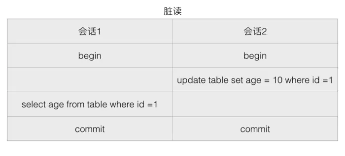
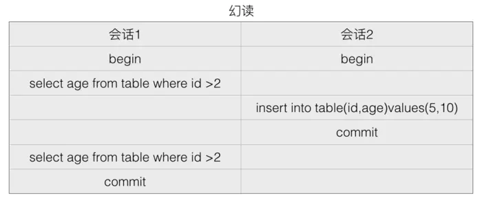
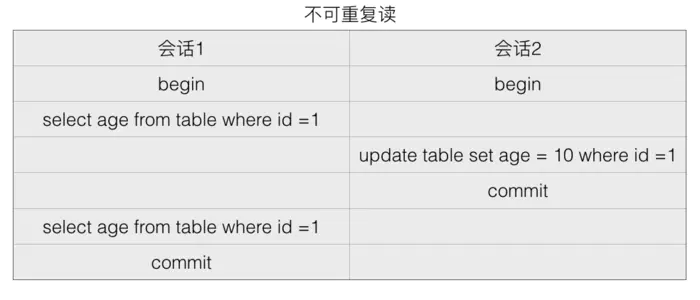

# 关系型数据库 与 非关系型数据库

## 关系型数据库
- 概念
    - 关系型数据库是指采用了关系模型来组织数据的数据库。简单来说，关系模式就是二维表格模型。
    - 主要代表：SQL Server，Oracle,Mysql,PostgreSQL。
- 优点
    - 容易理解，二维表的结构非常贴近现实世界，二维表格，容易理解。
    - 使用方便，通用的sql语句使得操作关系型数据库非常方便。
    - 易于维护，数据库的ACID属性，大大降低了数据冗余和数据不一致的概率。
- 瓶颈
    - 海量数据的读写效率。对于网站的并发量高，往往达到每秒上万次的请求，对于传统关系型数据库来说，硬盘I/o是一个很大的挑战。
    - 高扩展性和可用性。在基于web的结构中，数据库是最难以横向拓展的，当一个应用系统的用户量和访问量与日俱增的时候，数据库没有办法像web Server那样简单的通过添加更多的硬件和服务节点来拓展性能和负载能力。

## 非关系型数据库
- 概念
    - NoSQL非关系型数据库，主要指那些非关系型的、分布式的，且一般不保证ACID的数据存储系统，主要代表MongoDB，Redis、CouchDB。
        
    - NoSQL以键值来存储，且结构不稳定，每一个元组都可以有不一样的字段，这种就不会局限于固定的结构，可以减少一些时间和空间的开销。使用这种方式，为了获取用户的不同信息，不需要像关系型数据库中，需要进行多表查询。仅仅需要根据key来取出对应的value值即可。
- 分类
    - 面向高性能并发读写的key-value数据库
        - 具有极高的并发读写性能，例如Redis、Tokyo Cabint等。
    - 面向海量数据访问的面向文档数据库 Document
        - 可以在海量的数据库快速的查询数据。例如MongoDB以及CouchDB.
    - 面向可拓展的分布式数据库
        - 解决的主要问题是传统数据库的扩展性上的缺陷。

## 对比

-  存储上
    - Sql通常以数据库表的形式存储，例如存储用户信息，SQL中增加外部关系的话，需要在原表中增加一个外键，来关联外部数据表。如下：
    - NoSql采用key-value的形式存储

- 事务
    - SQL中如果多张表需要同批次被更新，即如果其中一张表跟新失败的话，其他表也不会更新成功。这种场景可以通过事务来控制，可以在所有命令完成之后，再统一提交事务。
    - 在Nosql中没有事务这个概念，每一个数据集都是原子级别的。

- 数据表 VS 数据集
    - 关系型是表格型的，存储在数据表的行和列中。彼此关联，容易提取。而非关系型是大块存储在一起。

- 预定义结构 VS 动态结构
    - 在sql中，必须定义好地段和表结构之后，才能够添加数据，例如定义表的主键、索引、外键等。表结构可以在定义之后更新，但是如果有比较大的结构变更，就会变的比较复杂。
    - 在Nosql数据库中，数据可以在任何时候任何地方添加。不需要预先定义。

- 纵向拓展 VS 横向拓展
    - 为了支持更多的并发量，SQL数据采用纵向扩展，提高处理能力，通过提高计算机性能来提高处理能力。
    - NoSql通过横向拓展，非关系型数据库天然是分布式的，所以可以通过集群来实现负载均衡。

- 如何选择

    - MySql+NoSql的组合方案，因为SQL和NoSql都有各自的优缺点。

    - 关系型数据库适合存储结构化数据，比如：用户的账号、地址：
        - 这些数据通常需要做结构化查询，比如说Join，这个时候，关系型数据库就要胜出一筹。
        - 这些数据的规模、增长的速度通常是可以预期的。
        - 事务性、一致性,适合存储比较复杂的数据。

    - NoSql适合存储非结构化数据，比如：文章、评论：
        - 这些数据通常用于模糊处理，例如全文搜索、机器学习，适合存储较为简单的数据。
        - 这些数据是海量的，并且增长的速度是难以预期的。
        - 按照key获取数据效率很高，但是对于join或其他结构化查询的支持就比较差。

## 数据库的ACID
- 原子性（Atomicity）
    - 原子性是指事务是一个不可分割的工作单位，事务中的操作要么都发生，要么都不发生。
- 一致性（Consistency）
    - 事务前后数据的完整性必须保持一致。
- 隔离性（Isolation）
    - 多个事务并发执行时，一个事务的执行不应影响其他事务的执行
- 持久性（Durability）
    - 持久性是指一个事务一旦被提交，它对数据库中数据的改变就是永久性的，接下来即使数据库发生故障也不应该对其有任何影响。

## 数据库的三范式
- 1NF是对属性的**原子性**，要求属性具有原子性，不可再分解；
    ```
    表：字段1、 字段2(字段2.1、字段2.2)、字段3 
    ```
    - 如学生（学号，姓名，性别，出生年月日），如果认为最后一列还可以再分成（出生年，出生月，出生日），它就不是一范式了，否则就是；
- 2NF是对记录的**唯一性**，要求记录有唯一标识，即实体的唯一性，即不存在部分依赖；
    ```
    表：学号、课程号、姓名、学分;
    ```
    - 这个表明显说明了两个事务:**学生信息**, **课程信息**;由于非主键字段必须依赖主键，这里学分依赖课程号，姓名依赖与学号，所以不符合二范式。
    - 数据冗余:，每条记录都含有相同信息；
    - 删除异常：删除所有学生成绩，就把课程信息全删除了；
    - 插入异常：学生未选课，无法记录进数据库；

- 3NF是对字段的**冗余性**，要求任何字段不能由其他字段派生出来，它要求字段没有冗余，即不存在传递依赖；
```
表: 学号, 姓名, 年龄, 学院名称, 学院电话
```
-   因为存在依赖传递: (学号) → (学生)→(所在学院) → (学院电话) 。
    - 可能会存在问题：
        - 数据冗余:有重复值；
        - 更新异常：有重复的冗余信息，修改时需要同时修改多条记录，否则会出现数据不一致的情况。


- 脏读， 幻读，不可重复读
    - `脏读`是指一个事务中访问到了另外一个事务未提交的数据.
    
        <p align="center">
        
        </p>

        - 如果会话 2 更新 age 为 10，但是在 commit 之前，会话 1 希望得到 age，那么会获得的值就是更新前的值。或者如果会话 2 更新了值但是执行了 rollback，而会话 1 拿到的仍是 10。这就是脏读。
        (没commit/回滚了)

    - `幻读`:一个事务读取2次，得到的记录条数不一致：

        <p align="center">
            
        </p>

        - 由于在会话 1 之间插入了一个新的值，所以得到的两次数据就不一样了。

    - `不可重复读`: 一个事务读取同一条记录2次，得到的结果不一致

        <p align="center">
        
        </p>
        
        - 由于在读取中间变更了数据，所以会话 1 事务查询期间的得到的结果就不一样了。

        
## 数据库的隔离性
- 数据库事务的隔离级别有4个，由低到高依次为
    - Read uncommitted, 未授权读取

        一个事务写数据时，另一个事务可以读但是不能写。

        - 通过**排他写锁**实现。
    
    - Read committed, 授权读取
        
        允许不可重复读取，不允许脏读取。这可以通过**瞬间共享读锁**和**排他写锁**实现

    - Repeatable read, 可重复读
        
        禁止不可重复读取和脏读取。
        通过**共享读锁**和**排他写锁**        
    
    - Serializable, 可串行化
        - 提供严格的事务隔离。它要求事务序列化执行，事务只能一个接着一个地执行，`不能并发执行`

