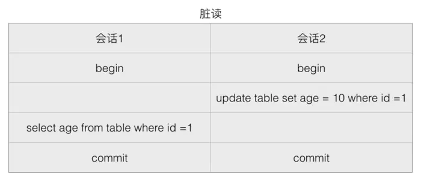

# 关系型数据库 与 非关系型数据库

## 关系型数据库
- 概念
    - 关系型数据库是指采用了关系模型来组织数据的数据库。简单来说，关系模式就是二维表格模型。
    - 主要代表：SQL Server，Oracle,Mysql,PostgreSQL。
- 优点
    - 容易理解，二维表的结构非常贴近现实世界，二维表格，容易理解。
    - 使用方便，通用的sql语句使得操作关系型数据库非常方便。
    - 易于维护，数据库的ACID属性，大大降低了数据冗余和数据不一致的概率。
- 瓶颈
    - 海量数据的读写效率。对于网站的并发量高，往往达到每秒上万次的请求，对于传统关系型数据库来说，硬盘I/o是一个很大的挑战。
    - 高扩展性和可用性。在基于web的结构中，数据库是最难以横向拓展的，当一个应用系统的用户量和访问量与日俱增的时候，数据库没有办法像web Server那样简单的通过添加更多的硬件和服务节点来拓展性能和负载能力。

## 非关系型数据库
- 概念
    - NoSQL非关系型数据库，主要指那些非关系型的、分布式的，且一般不保证ACID的数据存储系统，主要代表MongoDB，Redis、CouchDB。
        
    - NoSQL以键值来存储，且结构不稳定，每一个元组都可以有不一样的字段，这种就不会局限于固定的结构，可以减少一些时间和空间的开销。使用这种方式，为了获取用户的不同信息，不需要像关系型数据库中，需要进行多表查询。仅仅需要根据key来取出对应的value值即可。
- 分类
    - 面向高性能并发读写的key-value数据库
        - 具有极高的并发读写性能，例如Redis、Tokyo Cabint等。
    - 面向海量数据访问的面向文档数据库 Document
        - 可以在海量的数据库快速的查询数据。例如MongoDB以及CouchDB.
    - 面向可拓展的分布式数据库
        - 解决的主要问题是传统数据库的扩展性上的缺陷。

## 对比

-  存储上
    - Sql通常以数据库表的形式存储，例如存储用户信息，SQL中增加外部关系的话，需要在原表中增加一个外键，来关联外部数据表。如下：
    - NoSql采用key-value的形式存储

- 事务
    - SQL中如果多张表需要同批次被更新，即如果其中一张表跟新失败的话，其他表也不会更新成功。这种场景可以通过事务来控制，可以在所有命令完成之后，再统一提交事务。
    - 在Nosql中没有事务这个概念，每一个数据集都是原子级别的。

- 数据表 VS 数据集
    - 关系型是表格型的，存储在数据表的行和列中。彼此关联，容易提取。而非关系型是大块存储在一起。

- 预定义结构 VS 动态结构
    - 在sql中，必须定义好地段和表结构之后，才能够添加数据，例如定义表的主键、索引、外键等。表结构可以在定义之后更新，但是如果有比较大的结构变更，就会变的比较复杂。
    - 在Nosql数据库中，数据可以在任何时候任何地方添加。不需要预先定义。

- 纵向拓展 VS 横向拓展
    - 为了支持更多的并发量，SQL数据采用纵向扩展，提高处理能力，通过提高计算机性能来提高处理能力。
    - NoSql通过横向拓展，非关系型数据库天然是分布式的，所以可以通过集群来实现负载均衡。

- 如何选择

    - MySql+NoSql的组合方案，因为SQL和NoSql都有各自的优缺点。

    - 关系型数据库适合存储结构化数据，比如：用户的账号、地址：
        - 这些数据通常需要做结构化查询，比如说Join，这个时候，关系型数据库就要胜出一筹。
        - 这些数据的规模、增长的速度通常是可以预期的。
        - 事务性、一致性,适合存储比较复杂的数据。

    - NoSql适合存储非结构化数据，比如：文章、评论：
        - 这些数据通常用于模糊处理，例如全文搜索、机器学习，适合存储较为简单的数据。
        - 这些数据是海量的，并且增长的速度是难以预期的。
        - 按照key获取数据效率很高，但是对于join或其他结构化查询的支持就比较差。

## 数据库的ACID
- 原子性（Atomicity）
    - 原子性是指事务是一个不可分割的工作单位，事务中的操作要么都发生，要么都不发生。
- 一致性（Consistency）
    - 事务前后数据的完整性必须保持一致。
- 隔离性（Isolation）
    - 多个事务并发执行时，一个事务的执行不应影响其他事务的执行
- 持久性（Durability）
    - 持久性是指一个事务一旦被提交，它对数据库中数据的改变就是永久性的，接下来即使数据库发生故障也不应该对其有任何影响。

## 数据库的三范式
- 1NF是对属性的**原子性**，要求属性具有原子性，不可再分解；
    ```
    表：字段1、 字段2(字段2.1、字段2.2)、字段3 
    ```
    - 如学生（学号，姓名，性别，出生年月日），如果认为最后一列还可以再分成（出生年，出生月，出生日），它就不是一范式了，否则就是；
- 2NF是对记录的**唯一性**，要求记录有唯一标识，即实体的唯一性，即不存在部分依赖；
    ```
    表：学号、课程号、姓名、学分;
    ```
    - 这个表明显说明了两个事务:**学生信息**, **课程信息**;由于非主键字段必须依赖主键，这里学分依赖课程号，姓名依赖与学号，所以不符合二范式。
    - 数据冗余:，每条记录都含有相同信息；
    - 删除异常：删除所有学生成绩，就把课程信息全删除了；
    - 插入异常：学生未选课，无法记录进数据库；

- 3NF是对字段的**冗余性**，要求任何字段不能由其他字段派生出来，它要求字段没有冗余，即不存在传递依赖；
```
表: 学号, 姓名, 年龄, 学院名称, 学院电话
```
-   因为存在依赖传递: (学号) → (学生)→(所在学院) → (学院电话) 。
    - 可能会存在问题：
        - 数据冗余:有重复值；
        - 更新异常：有重复的冗余信息，修改时需要同时修改多条记录，否则会出现数据不一致的情况。


- 脏读， 幻读，不可重复读
    - `脏读`是指一个事务中访问到了另外一个事务未提交的数据.
    
        <p align="center">
        
        </p>

        - 如果会话 2 更新 age 为 10，但是在 commit 之前，会话 1 希望得到 age，那么会获得的值就是更新前的值。或者如果会话 2 更新了值但是执行了 rollback，而会话 1 拿到的仍是 10。这就是脏读。
        (没commit/回滚了)

    - `幻读`:一个事务读取2次，得到的记录条数不一致：

        <p align="center">
            
        </p>

        - 由于在会话 1 之间插入了一个新的值，所以得到的两次数据就不一样了。

    - `不可重复读`: 一个事务读取同一条记录2次，得到的结果不一致

        <p align="center">
        
        </p>
        
        - 由于在读取中间变更了数据，所以会话 1 事务查询期间的得到的结果就不一样了。

        
<!-- ## 数据库的隔离性
- 数据库事务的隔离级别有4个，由低到高依次为
    - Read uncommitted, 未授权读取

        一个事务写数据时，另一个事务可以读但是不能写。

        - 通过**排他写锁**实现。
    
    - Read committed, 授权读取
        
        允许不可重复读取，不允许脏读取。这可以通过**瞬间共享读锁**和**排他写锁**实现

    - Repeatable read, 可重复读
        
        禁止不可重复读取和脏读取。
        通过**共享读锁**和**排他写锁**        
    
    - Serializable, 可串行化
        - 提供严格的事务隔离。它要求事务序列化执行，事务只能一个接着一个地执行，`不能并发执行` -->

## 数据库的隔离性（解决方案）
- 解决方案是四种隔离级别：
- 未授权读取
    也称为读未提交（Read Uncommitted）：允许脏读取，但不允许更新丢失。如果一个事务已经开始写数据，则另外一个事务则不允许同时进行写操作，但允许其他事务读此行数据。该隔离级别可以通过“排他写锁”实现。
- 授权读取
    也称为读提交（Read Committed）：允许不可重复读取，但不允许脏读取。这可以通过“瞬间共享读锁”和“排他写锁”实现。读取数据的事务允许其他事务继续访问该行数据，但是未提交的写事务将会禁止其他事务访问该行。
- 可重复读取（Repeatable Read）
    可重复读取（Repeatable Read）：禁止不可重复读取和脏读取，但是有时可能出现幻读数据。这可以通过“共享读锁”和“排他写锁”实现。读取数据的事务将会禁止写事务（但允许读事务），写事务则禁止任何其他事务。
- 序列化（Serializable）
    序列化（Serializable）：提供严格的事务隔离。它要求事务序列化执行，事务只能一个接着一个地执行，不能并发执行。仅仅通过“行级锁”是无法实现事务序列化的，必须通过其他机制保证新插入的数据不会被刚执行查询操作的事务访问到。
    隔离级别越高，越能保证数据的完整性和一致性，但是对并发性能的影响也越大。对于多数应用程序，可以优先考虑把数据库系统的隔离级别设为Read Committed。它能够避免脏读取，而且具有较好的并发性能。尽管它会导致不可重复读、幻读和第二类丢失更新这些并发问题，在可能出现这类问题的个别场合，可以由应用程序采用悲观锁或乐观锁来控制。


## 锁
- 锁的分类。
- 基于锁的属性分类：共享锁、排他锁。
- 基于锁的粒度分类：表锁、行锁、记录锁、间隙锁、临键锁。
- 基于锁的状态分类：意向共享锁、意向排它锁。

### 属性锁
1. 共享锁(Share Lock)
    
    共享锁又称读锁，简称S锁；当一个事务为数据加上读锁之后，其他事务只能对该数据加读锁，而不能对数据加写锁，直到所有的读锁释放之后其他事务才能对其进行加持写锁。

    共享锁的特性主要是为了支持并发的读取数据，读取数据的时候不支持修改，避免出现重复读的问题。
2. 排他锁（eXclusive Lock）

    排他锁又称写锁，简称X锁；当一个事务为数据加上写锁时，其他请求将不能再为数据加任何锁，直到该锁释放之后，其他事务才能对数据进行加锁。

    排他锁的目的是在数据修改时候，不允许其他人同时修改，也不允许其他人读取。避免了出现脏数据和脏读的问题。

### 粒度锁

1. 表锁

    表锁是指上锁的时候锁住的是整个表，当下一个事务访问该表的时候，必须等前一个事务释放了锁才能进行对表进行访问；

    特点： 粒度大，加锁简单，容易冲突；

2. 行锁

    行锁是指上锁的时候锁住的是表的某一行或多行记录，其他事务访问同一张表时，只有被锁住的记录不能访问，其他的记录可正常访问；

    特点：粒度小，加锁比表锁麻烦，不容易冲突，相比表锁支持的并发要高；

3. 记录锁(Record Lock)

    记录锁也属于行锁中的一种，只不过记录锁的范围只是表中的某一条记录，记录锁是说事务在加锁后锁住的只是表的某一条记录。
    - 触发条件： 

        精准条件命中，并且命中的条件字段是唯一索引；

        例如：update user_info set name=’张三’ where id=1 ,这里的id是唯一索引。
4. 间隙锁(Gap Lock)

    间隙锁属于行锁中的一种，间隙锁是在事务加锁后其锁住的是表记录的某一个区间，当表的相邻ID之间出现空隙则会形成一个区间，遵循左开右闭原则。

    防止幻读问题，事务并发的时候，如果没有间隙锁，就会发生如下图的问题，在同一个事务里，A事务的两次查询出的结果会不一样。

5. 临键锁(Next-Key Lock)

    临键锁也属于行锁的一种，并且它是INNODB的行锁默认算法，总结来说它就是记录锁和间隙锁的组合，临键锁会把查询出来的记录锁住，同时也会把该范围查询内的所有间隙空间也会锁住，再之它会把相邻的下一个区间也会锁住。

### 状态锁

1. 状态锁包括意向共享锁和意向排它锁，把他们区分为状态锁的一个核心逻辑，是因为这两个锁都是都是描述是否可以对某一个表进行加表锁的状态。

2. 意向锁的解释：当一个事务试图对整个表进行加锁（共享锁或排它锁）之前，首先需要获得对应类型的意向锁（意向共享锁或意向共享锁）

- 意向共享锁
    当一个事务试图对整个表进行加共享锁之前，首先需要获得这个表的意向共享锁。

- 意向排他锁
    当一个事务试图对整个表进行加排它锁之前，首先需要获得这个表的意向排它锁。


## 乐观锁与悲观锁
- 乐观锁

    乐观锁在操作数据时非常乐观，认为别人不会同时修改数据。因此乐观锁不会上锁，只是在执行更新的时候判断一下在此期间别人是否修改了数据：如果别人修改了数据则放弃操作，否则执行操作。

- 悲观锁
    
    悲观锁在操作数据时比较悲观，认为别人会同时修改数据。因此操作数据时直接把数据锁住，直到操作完成后才会释放锁；上锁期间其他人不能修改数据。
## log 日志

1. 重做日志 redo log 

    - 作用：
        - 确保事务的持久性。
        - 防止在发生故障的时间点，尚有脏页未写入磁盘，在重启mysql服务的时候，根据redo log进行重做，从而达到事务的持久性这一特性。
    - 产生：
        - 事务开始之后就产生redo log
    - 释放：
        - 当对应事务的脏页写入到磁盘之后，redo log的使命也就完成了，

2. 回滚日志 undo log
    - 作用：
        - 保存了事务发生之前的数据的一个版本，可以用于回滚，同时可以提供多版本并发控制下的读（MVCC），也即非锁定读

    - 内容：
    - 逻辑格式的日志，在执行undo的时候，仅仅是将数据从逻辑上恢复至事务之前的状态，而不是从物理页面上操作实现的，这一点是不同于redo log的。
    - 产生
        - 事务开始之前，将当前是的版本生成undo log
    - 释放
        - 当事务提交之后，undo log并不能立马被删除，
        - 而是放入待清理的链表，由purge线程判断是否由其他事务在使用undo段中表的上一个事务之前的版本信息，决定是否可以清理undo log的日志空间。

- 二进制日志（binlog）
    - 作用：
        1. 用于复制，在主从复制中，从库利用主库上的binlog进行重播，实现主从同步。
        2. 用于数据库的基于时间点的还原。
    - 内容：
        - 逻辑格式的日志，可以简单认为就是执行过的事务中的sql语句。
    - 产生：
        - 事务提交的时候，一次性将事务中的sql语句（一个事物可能对应多个sql语句）按照一定的格式记录到binlog中。
    - 释放
        - 保持时间由参数expire_logs_days配置。超过时间自动删除。

## 死锁以及处理
1. 事务之间对资源访问顺序的交替
    - 出现原因：

        一个用户A 访问表A（锁住了表A），然后又访问表B；另一个用户B 访问表B（锁住了表B），然后企图访问表A；这时用户A由于用户B已经锁住表B，它必须等待用户B释放表B才能继续，同样用户B要等用户A释放表A才能继续，这就死锁就产生了。

    - 解决方法：
        
        这种死锁比较常见，是由于程序的BUG产生的，除了调整的程序的逻辑没有其它的办法。仔细分析程序的逻辑，对于数据库的多表操作时，尽量按照相同的顺序进行处理，尽量避免同时锁定两个资源，如操作A和B两张表时，总是按先A后B的顺序处理， 必须同时锁定两个资源时，要保证在任何时刻都应该按照相同的顺序来锁定资源。

2.  并发修改同一记录
    - 出现原因：
        用户A查询一条纪录，然后修改该条纪录；这时用户B修改该条纪录，这时用户A的事务里锁的性质由查询的共享锁企图上升到独占锁，而用户B里的独占锁由于A有共享锁存在所以必须等A释放掉共享锁，而A由于B的独占锁而无法上升的独占锁也就不可能释放共享锁，于是出现了死锁。这种死锁由于比较隐蔽，但在稍大点的项目中经常发生。

        一般更新模式由一个事务组成，此事务读取记录，获取资源（页或行）的共享 (S) 锁，然后修改行，此操作要求锁转换为排它 (X) 锁。如果两个事务获得了资源上的共享模式锁，然后试图同时更新数据，则一个事务尝试将锁转换为排它 (X) 锁。共享模式到排它锁的转换必须等待一段时间，因为一个事务的排它锁与其它事务的共享模式锁不兼容；发生锁等待。第二个事务试图获取排它 (X) 锁以进行更新。由于两个事务都要转换为排它 (X) 锁，并且每个事务都等待另一个事务释放共享模式锁，因此发生死锁。

    - 解决方法：
        1. 使用乐观锁进行控制。乐观锁大多是基于数据版本（Version）记录机制实现。即为数据增加一个版本标识，在基于数据库表的版本解决方案中，一般是通过为数据库表增加一个“version”字段来实现。读取出数据时，将此版本号一同读出，之后更新时，对此版本号加一。此时，将提交数据的版本数据与数据库表对应记录的当前版本信息进行比对，如果提交的数据版本号大于数据库表当前版本号，则予以更新，否则认为是过期数据。乐观锁机制避免了长事务中的数据库加锁开销（用户A和用户B操作过程中，都没有对数据库数据加锁），大大提升了大并发量下的系统整体性能表现。Hibernate 在其数据访问引擎中内置了乐观锁实现。需要注意的是，由于乐观锁机制是在我们的系统中实现，来自外部系统的用户更新操作不受我们系统的控制，因此可能会造成脏数据被更新到数据库中。
        
        2. 使用悲观锁进行控制。悲观锁大多数情况下依靠数据库的锁机制实现，如Oracle的Select … for update语句，以保证操作最大程度的独占性。但随之而来的就是数据库性能的大量开销，特别是对长事务而言，这样的开销往往无法承受。如一个金融系统，当某个操作员读取用户的数据，并在读出的用户数据的基础上进行修改时（如更改用户账户余额），如果采用悲观锁机制，也就意味着整个操作过程中（从操作员读出数据、开始修改直至提交修改结果的全过程，甚至还包括操作员中途去煮咖啡的时间），数据库记录始终处于加锁状态，可以想见，如果面对成百上千个并发，这样的情况将导致灾难性的后果。所以，采用悲观锁进行控制时一定要考虑清楚。

        3. SqlServer可支持更新锁
            
            为解决死锁，SqlServer引入更新锁,它有如下特征：
            1. 加锁的条件：当一个事务执行update语句时，数据库系统会先为事务分配一把更新锁。
            2. 解锁的条件：当读取数据完毕，执行更新操作时，会把更新锁升级为独占锁。
            3. 与其他锁的兼容性：更新锁与共享锁是兼容的，也就是说，一个资源可以同时放置更新锁和共享锁，但是最多放置一把更新锁。这样，当多个事务更新相同的数据时，只有一个事务能获得更新锁，然后再把更新锁升级为独占锁，其他事务必须等到前一个事务结束后，才能获取得更新锁，这就避免了死锁。
            4. 并发性能：允许多个事务同时读锁定的资源，但不允许其他事务修改它。
                ```SQL
                T1:
                begin tran
                select * from table(updlock) (加更新锁)
                update table set column1='hello'
                T2:
                begin tran
                select * from table(updlock)
                update table set column1='world'
                ```
                


3. 索引不当导致全表扫描
    - 出现原因：
        
        如果在事务中执行了一条不满足条件的语句，执行全表扫描，把行级锁上升为表级锁，多个这样的事务执行后，就很容易产生死锁和阻塞。类似的情况还有当表中的数据量非常庞大而索引建的过少或不合适的时候，使得经常发生全表扫描，最终应用系统会越来越慢，最终发生阻塞或死锁。

- 解决方法：
    
    SQL语句中不要使用太复杂的关联多表的查询；使用“执行计划”对SQL语句进行分析，对于有全表扫描的SQL语句，建立相应的索引进行优化。

4. 事务封锁范围大且相互等待


## Innodb 索引结构。 聚簇索引、非聚簇索引、辅助索引、主键索引、唯一索引
- 聚簇索引：

    首先 innodb 引擎默认在主键上建立聚集索引，通常说的主键索引就是聚集索引，聚集索引会保存行上的所有数据，因此不需要额外的 IO

- 辅助索引：
    
    辅助索引 (Secondary Index) , 叶子节点只保存了行的键值和指向对应行的 "书签" , 该书签用来告诉InnoDB哪里可以找到与索引相对应的行数据。

- 联合索引
    
    联合索引是指对表上的多个列进行索引。（B+树）


## MYSQL 的引擎有什么区别

- InnoDB：支持事务处理，支持外键，支持崩溃修复能力和并发控制。如果需要对事务的完整性要求比较高（比如银行），要求实现并发控制（比如售票），那选择InnoDB有很大的优势。如果需要频繁的更新、删除操作的数据库，也可以选择InnoDB，因为支持事务的提交（commit）和回滚（rollback）。

- MyISAM：插入数据快，空间和内存使用比较低。如果表主要是用于插入新记录和读出记录，那么选择MyISAM能实现处理高效率。如果应用的完整性、并发性要求比 较低，也可以使用。如果数据表主要用来插入和查询记录，则MyISAM引擎能提供较高的处理效率

- MEMORY：所有的数据都在内存中，数据的处理速度快，但是安全性不高。如果需要很快的读写速度，对数据的安全性要求较低，可以选择MEMOEY。它对表的大小有要求，不能建立太大的表。所以，这类数据库只使用在相对较小的数据库表。如果只是临时存放数据，数据量不大，并且不需要较高的数据安全性，可以选择将数据保存在内存中的Memory引擎，MySQL中使用该引擎作为临时表，存放查询的中间结果

- 如果只有INSERT和SELECT操作，可以选择Archive，Archive支持高并发的插入操作，但是本身不是事务安全的。Archive非常适合存储归档数据，如记录日志信息可以使用Archiv

##  mysql 执行语句过程。
- 客户端发送一条查询给服务器。
- 服务器先检查查询缓存，如果命中了缓存，则立刻返回存储在缓存中的结果。否则进入下一阶段。
- 服务器端进行SQL解析、预处理，再由优化器生成对应的执行计划。
- MySQL根据优化器生成的执行计划，再调用存储引擎的API来执行查询。
- 将结果返回给客户端。