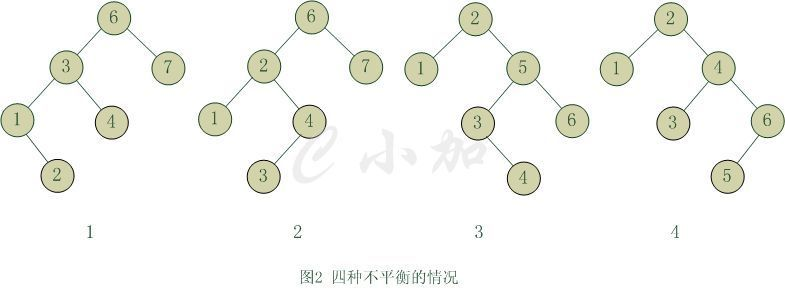
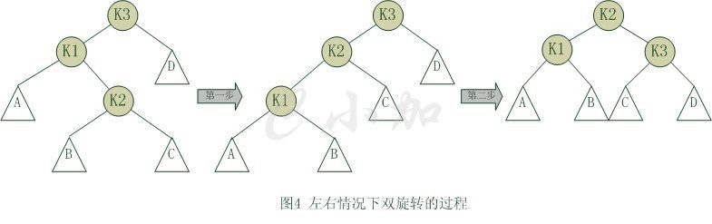

## 平衡二叉树
- 平衡二叉树（Balanced Binary Tree）又被称为AVL树（有别于AVL算法），且具有以下性质：它是一 棵空树或它的左右两个子树的高度差的绝对值不超过1，并且左右两个子树都是一棵平衡二叉树。这个方案很好的解决了二叉查找树退化成链表的问题，把插入，查找，删除的时间复杂度最好情况和最坏情况都维持在O(logN)。但是频繁旋转会使插入和删除牺牲掉O(logN)左右的时间，不过相对二叉查找树来说，时间上稳定了很多。

- 平衡二叉树大部分操作和二叉查找树类似，主要不同在于插入删除的时候平衡二叉树的平衡可能被改变，并且只有从那些插入点到根结点的路径上的结点的平衡性可能被改变，因为只有这些结点的子树可能变化。

- 平衡二叉树不平衡的情形：
- 把需要重新平衡的结点叫做α，由于任意两个结点最多只有两个儿子，因此高度不平衡时，α结点的两颗子树的高度相差2.容易看出，这种不平衡可能出现在下面4中情况中：
    1. 对α的左儿子的左子树进行一次插入
    2. 对α的左儿子的右子树进行一次插入
    3. 对α的右儿子的左子树进行一次插入
    4. 对α的右儿子的右子树进行一次插入
    

    
    

    - 情形1和情形4是关于α的镜像对称，二情形2和情形3也是关于α的镜像对称，因此理论上看只有两种情况，但编程的角度看还是四种情形。

    - 第一种情况是插入发生在“外边”的情形（左左或右右），该情况可以通过一次单旋转完成调整；第二种情况是插入发生在“内部”的情形（左右或右左），这种情况比较复杂，需要通过双旋转来调整。

### 单旋转
- k2结点不满足平衡性，它的左子树k1比右子树z深两层，k1子树中更深的是k1的左子树x，因此属于左左情况。

- 为使树恢复平衡，我们把k2变成这棵树的根节点，因为k2大于k1，把k2置于k1的右子树上，而原本在k1右子树的Y大于k1，小于k2，就把Y置于k2的左子树上，这样既满足了二叉查找树的性质，又满足了平衡二叉树的性质。

### 双旋转
第一步，把k1作为根，进行一次右右旋转，旋转之后就变成了左左情况，所以第二步再进行一次左左旋转，最后得到了一棵以k2为根的平衡二叉树。

